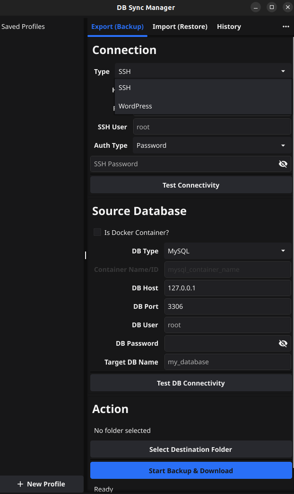

# DB Sync Manager

A cross-platform desktop GUI application built with Go and Fyne v2 for managing database synchronizations. It allows you to export large databases from remote Linux servers via SSH, WordPress sites, or Docker containers, and restore them efficiently.

 


## Features

### 🔌 Connectivity
*   **SSH:** Connect to any remote Linux server using Password or Private Key authentication.
*   **WordPress:** Direct integration with WordPress sites via a secure, auto-generated plugin (no SSH required).
*   **Docker:** Seamless support for databases running inside Docker containers.
*   **Databases:** Support for **MySQL** and **MariaDB**.

### 🚀 Core Functions
*   **Export (Backup):** Stream large database dumps (5GB+) with on-the-fly GZIP compression.
*   **Import (Restore):** Stream uploads and restores to remote servers or local instances.
*   **Profile Management:**
    *   Save connection details for quick access.
    *   **Smart History:** Remembers your last destination folder per profile.
    *   Create, Update, and **Delete** profiles easily.

### 📊 Activity & History
*   **History Tab:** A data grid view of all past operations with timestamps, status, and file sizes.
*   **Persistence:** All logs are saved locally to `logs.json`.

### 🛠️ Diagnostics
*   **Test Connectivity:** Built-in tools to verify Server (SSH/HTTP) and Database connections before running heavy operations.

## Installation & Running

### Run via Script (Linux)
This script handles dependency checks and runs the application.

```bash
./run.sh
```
*Note: You may need to install `gcc`, `libgl1-mesa-dev`, and `xorg-dev` if prompted.*

### Build Binaries
To generate standalone executables for Linux and Windows:

```bash
./build.sh
```
*Artifacts will be created as `dback-linux` and `dback-windows.exe`.*

### Docker Alternative
If you have issues with system dependencies, you can run the app in a container:

```bash
./docker-run.sh
```

## WordPress Integration Guide

1.  Open the **Export** tab.
2.  Select **Type: WordPress**.
3.  Click **Generate Plugin** and save the `dback-sync-plugin.zip`.
4.  **Install** this plugin on your WordPress site (Plugins > Add New > Upload).
5.  Copy your WordPress **URL** into the app.
6.  The **API Key** is automatically filled (it matches the key embedded in the plugin).
7.  Click **Test Connectivity** or **Start Backup**.

## FAQ

### Why does this app require X11/GL libraries?
This application is built using **Fyne**, a high-performance GUI toolkit for Go. Fyne uses **OpenGL** to render its graphics (GPU acceleration). On Linux, interfacing with OpenGL and creating windows requires the **X11** and **OpenGL** development headers.
