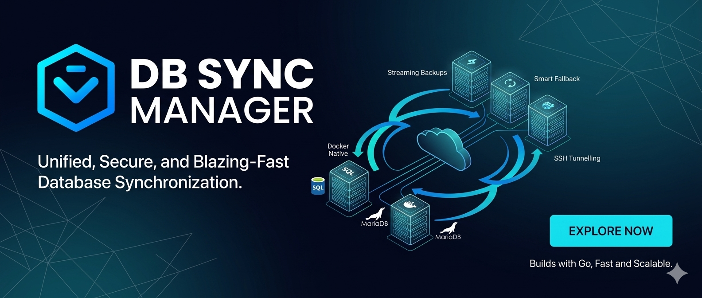
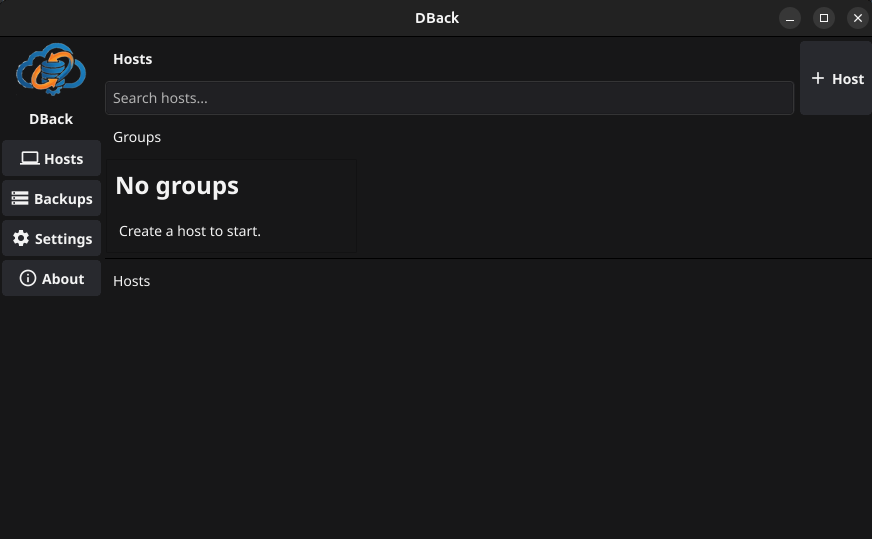

# DBack — DB Sync Manager



A Linux desktop GUI built with Go and [Gio](https://gioui.org) for MySQL/MariaDB backup and restore. DBack connects to remote Linux servers via SSH or Jump Host, or databases inside Docker containers. Backups stream to local files; restores target any saved host.

**Repository:** [https://github.com/devlifeX/dback/](https://github.com/devlifeX/dback/)

## Features

### Connectivity
- **SSH / Jump Host** — password or private key authentication
- **Docker** — MySQL/MariaDB inside containers (`docker exec`)
- **Databases** — MySQL and MariaDB only

### Backup & Restore
- **Streaming first** — large dumps (5GB+) with on-the-fly `zstd`/`gzip` compression
- **Smart fallback** — automatic retry with remote tmp-file when SSH streams fail
- **Resume & checksum** — tmp-file strategy supports offset resume and size/checksum validation
- **Preflight** — mandatory checks before each job: Linux OS, dump/client tools, compression, disk space, writable tmp paths, Docker container status
- **Restore flow** — select a backup, pick a destination host, run import with that host's pre/post queries
- **Job center** — progress and cancel controls in the Backups screen

### Host Management
- **Unified host model** — one connection, backup folder, and import queries per host (no separate Export/Import tabs)
- **Duplicate** — clone a host with one click; the copy gets a new ID and a numbered name (`Production 1`, `Production 2`, …)
- **Groups & search** — clickable group filters, single-line search, and compact group chips
- **Legacy migration** — old profiles with separate export/import settings are flattened on load; differing import settings become a separate host named `Name (import)`

### App Data Transfer
- Export/import hosts, templates, backup history metadata, and activity logs from **Settings**
- Backup `.sql.gz` files are **not** included in the bundle
- Secrets excluded by default
- Optional **encrypted export** with master password (Argon2id + AES-256-GCM)
- **Non-destructive merge** — imported data merges by ID or name; conflicts prompt for confirmation before overwrite
- Legacy profile-only bundles are still accepted on import

### SQL Templates
- **Templates** section — create, edit, delete reusable SQL snippets
- **Append** — add template text to pre/post import queries without overwriting existing SQL
- **Placeholders** — `{databasename}`, `{host}`, `{profile}`, `{dbuser}`

### Diagnostics & Logging
- Test SSH/HTTP and database connectivity from the host editor
- Structured activity logs in `~/.config/dback/logs.json`: operation ID, phase, strategy, attempt, masked commands
- Debug mode mirrors logs to stderr (`--debug` or `DBACK_DEBUG=1`)

## Quick Start

### Run

```bash
./run.sh
```

With debug logging:

```bash
./run.sh --debug
# or
DBACK_DEBUG=1 ./run.sh
```

### Build (Linux only)

```bash
./build.sh
# or
./build.sh linux
```

Output: `dist/dback-linux`

### Build from source

Requirements: **Go 1.21+** and Gio development libraries.

On Debian/Ubuntu:

```bash
sudo apt-get update && sudo apt-get install -y \
  build-essential pkg-config libvulkan-dev xorg-dev libwayland-dev \
  libxkbcommon-dev libxkbcommon-x11-dev libx11-xcb-dev libxcursor-dev \
  libxfixes-dev libegl-dev
```

Then:

```bash
go build -o dist/dback-linux .
```

### Docker alternative

If system dependencies are problematic:

```bash
./docker-run.sh
```

## Default Paths

| Purpose | Path |
|---------|------|
| App config & data | `~/.config/dback` |
| Default backups | `~/dback/backups` |
| Profiles (vault) | `~/.config/dback/app_data.vault.json` |
| Templates | encrypted inside vault |
| Backup history | encrypted inside vault |
| Activity logs | encrypted inside vault |

Each host can override the backup destination folder.

## Security

- On first launch (or when upgrading from legacy plaintext storage), DBack prompts for a **master key**.
- All internal app data (`profiles`, `templates`, `history`, `logs`) is stored in a single encrypted vault at `~/.config/dback/app_data.vault.json`.
- Legacy plaintext files are archived as `*.legacy` after successful migration.
- Export App Data files remain optional plain or encrypted bundles for transfer between machines.

## Usage

### Hosts
1. Open **Hosts** → **+ Host**
2. Configure connection (SSH, Jump Host, or Docker)
3. Set database credentials and backup destination
4. Optional: configure pre/post import queries on the **Queries** tab
5. Use **Backup** on the host card, or **Duplicate** to clone settings

### Restore
1. Open **Backups** → filter by host if needed (newest backups appear first)
2. Select a backup file
3. Choose a destination host
4. Click **Import to Selected Host**

### App data export/import
1. Open **Settings**
2. Optionally enable **Include saved passwords and keys (encrypted)**
3. **Export App Data** / **Import App Data**
4. When including secrets, enter a master password for encryption/decryption

## Why is it fast?

- **Direct streaming** — data flows from database to file without intermediate storage
- **Native tools** — uses `mysqldump` / `mariadb-dump` on the server
- **Smart compression** — prefers Zstandard (`zstd`) when available
- **No temp files by default** — tmp-file fallback only when streaming fails

## About

Created by **dariush vesal**.

- Email: `dariush.vesal@gmail.com`
- GitHub: [https://github.com/devlifeX/dback](https://github.com/devlifeX/dback)

## FAQ

### Why does DBack require Vulkan/X11 libraries?
DBack uses **Gio**, a GPU-accelerated GUI toolkit. On Linux, Gio renders through Vulkan and creates windows via X11/Wayland, which requires development headers at build time.

### Which platforms are supported?
**Linux desktop only.** macOS, Windows, and Android are not supported in this release.

### What happened to PostgreSQL and CouchDB?
Removed. DBack now supports **MySQL and MariaDB** only.

### What happened to separate Export/Import settings per profile?
Profiles are now independent **hosts** with a single connection. Legacy dual settings are migrated automatically on first load.
