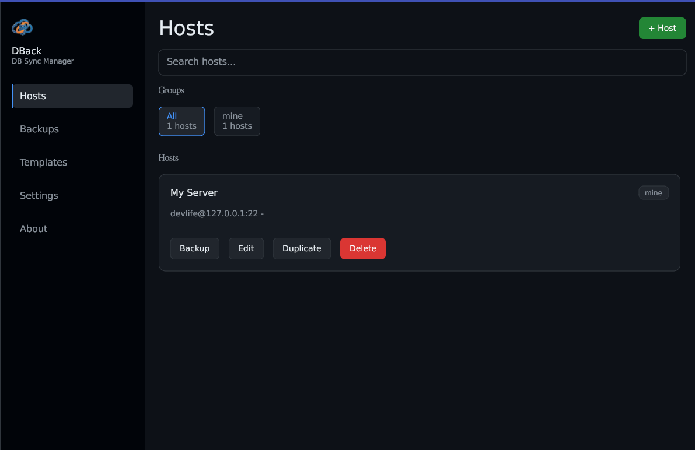
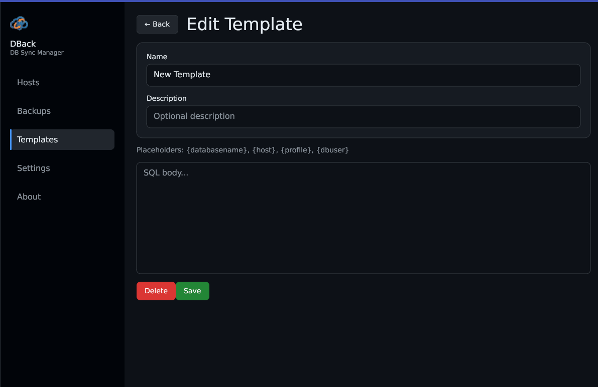
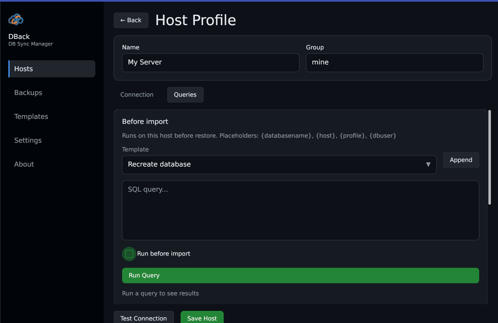

# DBack — DB Sync Manager

**Desktop GUI for MySQL/MariaDB backup and restore over SSH, Jump Host, Docker, or WordPress.**

DBack connects to remote Linux servers or WordPress sites, streams database dumps to local files with compression, and restores backups to any saved host. Hosts, templates, history, and logs live in an encrypted local vault. Built with Go and [Gio](https://gioui.org).

**Repository:** [github.com/devlifeX/dback](https://github.com/devlifeX/dback/)

## Install

### Ubuntu / Debian (PPA — recommended)

Install from the [Launchpad PPA](https://launchpad.net/~devlifex/+archive/ubuntu/dback) (Ubuntu 22.04 **jammy** and 24.04 **noble**):

```bash
sudo add-apt-repository ppa:devlifex/dback
sudo apt update
sudo apt install dback
```

Then run **dback** from the application menu or:

```bash
dback
```

Updates arrive with `sudo apt update && sudo apt upgrade` after new PPA builds are published.

### Ubuntu / Debian (.deb from GitHub Releases)

Download `dback_*_amd64.deb` from [GitHub Releases](https://github.com/devlifeX/dback/releases), then:

```bash
sudo apt install ./dback_*_amd64.deb
```

### Windows

Download `dback-windows.exe` from [GitHub Releases](https://github.com/devlifeX/dback/releases) and run it.

### Build from source

See [Quick Start](#quick-start) below (`./run.sh` or `./build.sh`).

Maintainers: PPA upload and packaging — [`ppa.md`](ppa.md).

## Highlights

- **Streaming backups** — large dumps (5GB+) with on-the-fly `zstd`/`gzip` compression
- **Smart fallback** — retries with a remote tmp-file when SSH streams fail; supports resume and checksum validation
- **Dry-Run Verify** — SHA256 checksum + table fingerprint at backup time; optional deep verify restores to a temp database and compares row counts (SSH and WordPress)
- **Unified hosts** — one connection, backup folder, and import queries per host
- **WordPress hosts** — backup/import/query via the embedded **DBack DB Tools** plugin (pure PHP, no shell on the server)
- **Encrypted vault** — profiles, templates, history, and logs stored in `app_data.vault.json`
- **Remote sync** — push/pull encrypted app settings to S3-compatible storage (AWS S3, MinIO, etc.)
- **SQL templates** — reusable snippets with placeholders for pre/post import queries
- **Connection testing** — step-by-step checks from the host editor (SSH + DB, or WordPress REST + preflight)
- **Modern UI** — dark GitHub-style desktop interface with sidebar navigation and host overflow menus

## Screenshots

### Hosts
Manage remote servers, filter by group, search, and run backup actions from host cards.



### SQL Templates
Create reusable SQL snippets with placeholders for pre/post import queries.



### Host profile — import queries
Configure pre-import SQL, append templates, and test queries before restore.



## Features

### Connectivity
- **SSH / Jump Host** — password or private key authentication
- **Docker** — MySQL/MariaDB inside containers (`docker exec`)
- **WordPress** — REST API via the **DBack DB Tools** plugin (`dback/v1`); download a site-specific plugin zip from the host editor
- **Databases** — MySQL and MariaDB only
- **Connection test** — guided SSH + database check, or WordPress ping + preflight + `SELECT 1`

### Backup & Restore
- **Preflight checks** — SSH: OS, dump/client tools, disk space, Docker status; WordPress: PHP, zlib, DB, uploads via plugin `/preflight`
- **Restore flow** — select a backup, pick a destination host, run pre-import SQL, import, then optional post-import SQL
- **Pre/post import queries** — run before restore starts; failures abort the import and show an error in the app
- **Job center** — progress and cancel controls on the Backups screen
- **Dry-Run Verify** — two-layer backup verification (see below)
- **Remembered import destination** — the last destination host chosen for a given source host is stored in the vault and pre-selected on the next import or deep verify

### Dry-Run Verify (backup verification)

Verification always compares a backup against the **fingerprint captured when that backup was created** — not against the live production database.

**Layer 1 — at backup time (automatic)**

After every successful backup, DBack:

1. Stores a **SHA256 checksum** of the `.sql.gz` file
2. Queries the **source database** for per-table row counts (`information_schema`) and saves them as a fingerprint in backup history (vault)
3. Runs an automatic **quick verify** (SHA256 match on disk)

Works for **SSH / Jump Host / Localhost** and **WordPress** hosts.

**Layer 2 — quick verify (file integrity)**

Re-checks that the local backup file’s SHA256 still matches the stored checksum. No database connection. Useful after copying files or if you suspect local corruption.

**Layer 3 — deep verify (optional)**

On demand, DBack:

1. Confirms file integrity (SHA256)
2. Restores the backup into a **temporary database** on a host you choose (`dback_verify_*` — production DB is not replaced)
3. Runs exact `COUNT(*)` per table and compares against the stored fingerprint
4. Drops the temporary database when finished

Deep verify uses the same restore path as a normal import (SSH streaming/tmp-file or WordPress REST). The destination host must allow import (`Import protected` must be off).

**Interpreting results**

| Outcome | Meaning |
|---------|---------|
| SHA256 matched, rows match | Backup file intact and restored row counts match the fingerprint |
| SHA256 matched, rows differ | File is intact; row counts differ from the fingerprint snapshot. The fast fingerprint uses approximate InnoDB estimates — this does not always mean the backup is unusable |
| No fingerprint | Backup was created before this feature, or capture failed — create a new backup to enable deep verify |

**Limits**

- Fingerprint row counts at backup time are **approximate** (fast mode via `information_schema.table_rows`).
- Deep verify needs the `.sql.gz` on **local disk** and a writable import destination.
- Remote sync uploads **metadata only** — checksum and fingerprint travel with history; you must have the backup file locally to verify.

### WordPress plugin (DBack DB Tools)
- Embedded in the desktop app; **Download Plugin** builds a zip with a per-host API token hardcoded in the plugin
- Plugin lives in [`wordpress/dback-db-tools/`](wordpress/dback-db-tools/) — pure PHP export/import/query (no `exec` / shell on shared hosting)
- Install on the site via **Plugins → Upload Plugin**; match **Site URL** in DBack to WordPress **Settings → General**
- Optional **Target database** on the host — empty uses `wp-config.php` default; set a name to create/select that DB on import and post-import queries
- Dev-only files (e.g. `wordpress_agent.md`, `*.md`) are excluded from the downloadable zip — see `release_zip.go`

### Host Management
- **Host cards** — green **Backup** action plus a **⋮** overflow menu for Edit, Duplicate, and Delete
- **Duplicate** — clone a host with one click (`Production 1`, `Production 2`, …)
- **Groups & search** — filter by group, search by name
- **Legacy migration** — old export/import profiles are flattened on load

### App Data Transfer
Settings has two tabs: **Export** and **Sync**.

**Export / Import (local file)**
- Export/import hosts, templates, backup history metadata, and activity logs
- Backup `.sql.gz` files are **not** included in the bundle
- Encrypted export with an export password (Argon2id + AES-256-GCM)
- Non-destructive merge — conflicts prompt before overwrite

**Remote Sync (S3-compatible)**
- Push or pull the same encrypted app-data bundle to `{bucket}/dback/app-data.json`
- Works with AWS S3, MinIO, and other S3-compatible endpoints
- Configure endpoint, region, bucket, access key, secret key, and SSL
- **Test Connection** verifies bucket access and read/write permissions under `dback/`
- **Push** / **Pull** appear after a successful connection test
- Encrypted with your **vault master key** (the same key used to unlock DBack), not the export password
- Sync settings (S3 credentials) are included in the remote bundle
- Pull downloads the bundle, asks for confirmation, then merges like a local import
- **Sync log** (local only, not uploaded): last push and last pull timestamps

### SQL Templates
- Create, edit, and delete reusable SQL snippets
- Append template text to pre/post import queries
- Placeholders: `{databasename}`, `{host}`, `{profile}`, `{dbuser}`

### Diagnostics & Logging
- Test SSH and database connectivity from the host editor
- Structured activity logs (operation ID, phase, strategy, attempt, masked commands)
- Debug mode mirrors logs to stderr (`--debug` or `DBACK_DEBUG=1`)

## Quick Start

### Run from source

```bash
./run.sh
```

With debug logging:

```bash
./run.sh --debug
# or
DBACK_DEBUG=1 ./run.sh
```

### Build (Linux)

```bash
./build.sh
# or
./build.sh linux
```

Output:
- `dist/dback-linux`
- `dist/dback` launcher wrapper (handles common EGL/GPU driver issues)
- `dist/dback_${APP_VERSION}_amd64.deb` — Debian/Ubuntu installer with menu icon (`/usr/bin/dback`)

Set the app version at build time:

```bash
APP_VERSION=3.8.1 ./build.sh linux
```

Version appears in **About** inside the app. Use **Check for updates** on the About screen to compare against [GitHub Releases](https://github.com/devlifeX/dback/releases); when a newer version exists, DBack downloads the matching asset and installs it (Linux `.deb` via `pkexec` + `apt`, Windows `.exe` with restart helper).

### Build (Windows)

Requirements: **Go 1.21+** and a Windows development environment.

```powershell
go build -ldflags "-X main.appVersion=3.8.1" -o dist/dback-windows.exe .
```

### Build manually (Linux)

Requirements: **Go 1.21+** and Gio development libraries.

On Debian/Ubuntu:

```bash
sudo apt-get update && sudo apt-get install -y \
  build-essential pkg-config libvulkan-dev xorg-dev libwayland-dev \
  libxkbcommon-dev libxkbcommon-x11-dev libx11-xcb-dev libxcursor-dev \
  libxfixes-dev libegl-dev
```

Then:

```bash
go build -ldflags "-X main.appVersion=3.8.1" -o dist/dback-linux .
```

### Docker alternative

If system dependencies are problematic:

```bash
./docker-run.sh
```

### GitHub Releases

Tagged releases (`v*`) are built automatically by GitHub Actions:

| Platform | Artifact |
|----------|----------|
| Linux | `dback-linux`, `dback_{version}_amd64.deb` |
| Windows | `dback-windows.exe` |

Install on Ubuntu/Debian: use the [PPA](#install) or `sudo apt install ./dback_*_amd64.deb` from the release assets.

Or use **About → Check for updates** inside the running app.

## Default Paths

| Purpose | Path |
|---------|------|
| App config & data | `~/.config/dback` |
| Default backups | Linux: `~/dback/backups` — Windows: `%USERPROFILE%\Documents\dback` |
| Encrypted vault | `~/.config/dback/app_data.vault.json` |
| Remote sync object | `{bucket}/dback/app-data.json` |
| SSH known hosts | `~/.config/dback/ssh_known_hosts` |

Hosts, templates, backup history, and activity logs are stored inside the encrypted vault. Each host can override the backup destination folder.

## Security

- On first launch, DBack prompts for a **master key** (minimum 8 characters; confirmation required when creating a new vault).
- Legacy plaintext files are removed after successful migration into the vault.
- **App Data Transfer** exports require an export password. **Remote Sync** uses the vault master key instead. Metadata in history and logs may still contain host names and paths.
- S3 credentials are stored in the encrypted vault and included in sync bundles — use bucket policies and least-privilege IAM where possible.
- SSH uses **TOFU host key verification** — unknown keys are saved on first connect; mismatches are rejected.
- Remote database commands validate and shell-escape profile fields to reduce injection risk.
- Password fields are masked in the UI. Error messages are sanitized unless debug mode is enabled.

## Usage

### Hosts
1. Open **Hosts** → **+ Host**
2. Choose connection type: **SSH**, **Jump Host**, **Localhost**, or **WordPress**
3. For SSH/Docker: configure server access, database credentials, and backup destination
4. For **WordPress**: set **Site URL**, generate or reuse an **API key**, click **Download Plugin**, upload the zip on the WordPress site, then activate the plugin
5. Optional: configure pre/post import queries on the **Queries** tab
6. Use **Test Connection** in the host editor (SSH + DB, or WordPress REST)
7. On a host card, click **Backup** or open the **⋮** menu for Edit, Duplicate, or Delete

### WordPress host (quick path)
1. **+ Host** → connection type **WordPress**
2. **Site URL** — e.g. `https://example.com` (must match the live site URL)
3. **Generate Token** (once) → **Download Plugin** → upload `.zip` in WordPress admin
4. **Save Host** so the token is stored in the vault (re-download uses the same token)
5. **Test Connection** — should pass ping, preflight, and database query
6. **Backup** / **Import** work like other hosts; credentials come from `wp-config.php` on the site

For plugin and REST details, see [`wordpress/dback-db-tools/wordpress_agent.md`](wordpress/dback-db-tools/wordpress_agent.md).

### Restore
1. Open **Backups** → filter by host if needed
2. Select a backup file
3. Choose a destination host (DBack remembers the last destination per source host)
4. Click **Import to Selected Host**

### Deep verify (optional)
1. Open **Backups** → pick a backup with a fingerprint (new backups only)
2. Run **deep verify** and choose a destination host that allows import
3. Review the report — SHA256 must pass; row comparison uses the fingerprint from backup time
4. Progress appears in the Jobs tab like other long operations

### App data export/import
1. Open **Settings** → **Export** tab
2. **Export App Data** — enter an export password
3. **Import App Data** — enter the export password for encrypted bundles

### Remote sync (S3)
1. Open **Settings** → **Sync** tab
2. Enter S3 endpoint, bucket, and credentials → **Save**
3. Click **Test Connection** — on success, **Push** and **Pull** appear
4. **Push** — uploads encrypted app data to `dback/app-data.json`
5. **Pull** — downloads the remote bundle, confirms, then merges into this device
6. Scroll to **Sync log** at the bottom to see last push/pull times (stored locally only)

## Why is it fast?

- **Direct streaming** — data flows from database to file without intermediate storage
- **SSH path** — uses `mysqldump` / `mariadb-dump` on the server when available
- **WordPress path** — plugin streams gzip SQL over HTTP (PDO or mysqli fallback; no full-file buffering)
- **Smart compression** — prefers Zstandard (`zstd`) when available on SSH hosts
- **No temp files by default** — SSH tmp-file fallback only when streaming fails

## About

Created by **dariush vesal**.

- Email: `dvworkmail2017@gmail.com`
- GitHub: [github.com/devlifeX/dback](https://github.com/devlifeX/dback/)

## FAQ

### Why does DBack require Vulkan/X11 libraries on Linux?
DBack uses **Gio**, a GPU-accelerated GUI toolkit. On Linux, Gio renders through Vulkan and creates windows via X11/Wayland, which requires development headers at build time.

### Which platforms are supported?
- **Linux desktop** — primary platform; use `./run.sh`, `./build.sh`, or download `dback-linux` from GitHub Releases
- **Windows** — `dback-windows.exe` is built on tagged releases via GitHub Actions; build locally with `go build` on Windows
- **macOS / Android** — not supported in this release

Remote **SSH/Docker/Jump** targets must run **Linux**.

**WordPress** hosts only need a WordPress site with the DBack DB Tools plugin installed (any PHP/MySQL hosting; no SSH required on the server).

### What happened to PostgreSQL and CouchDB?
Removed. DBack now supports **MySQL and MariaDB** only.

### What happened to separate Export/Import settings per profile?
Profiles are now independent **hosts** with a single connection. Legacy dual settings are migrated automatically on first load.

### What is included in remote sync?
The same data as **Export App Data**: hosts, templates, backup history metadata (including SHA256 checksums and fingerprints), activity logs, and sync settings. Backup `.sql.gz` files and local sync timestamps (last push/pull) are **not** uploaded. To run quick or deep verify, the backup file must exist on the device that performs the check.

### How does Dry-Run Verify work?
At backup time DBack saves a SHA256 hash and a table row fingerprint from the source DB. Quick verify checks the file hash only. Deep verify restores into a temporary database on a host you pick, counts rows, and compares to that fingerprint — without overwriting production. See [Dry-Run Verify](#dry-run-verify-backup-verification) above.

### Can I use MinIO or a self-hosted S3 endpoint?
Yes. Enter the host (with or without `https://`) and port, set **Use SSL** as needed, and provide bucket credentials. The remote object path is always `dback/app-data.json` inside your bucket.

### How does WordPress backup work?
DBack embeds the **DBack DB Tools** plugin, injects your host API token into the zip, and talks to `https://your-site/wp-json/dback/v1` for export, import, query, ping, and preflight. The plugin uses pure PHP (no shell commands), suitable for shared hosting.

### Where is the WordPress plugin source?
[`wordpress/dback-db-tools/`](wordpress/dback-db-tools/). Developer docs: [`wordpress_agent.md`](wordpress/dback-db-tools/wordpress_agent.md). Go app architecture: [`agent.md`](agent.md).
