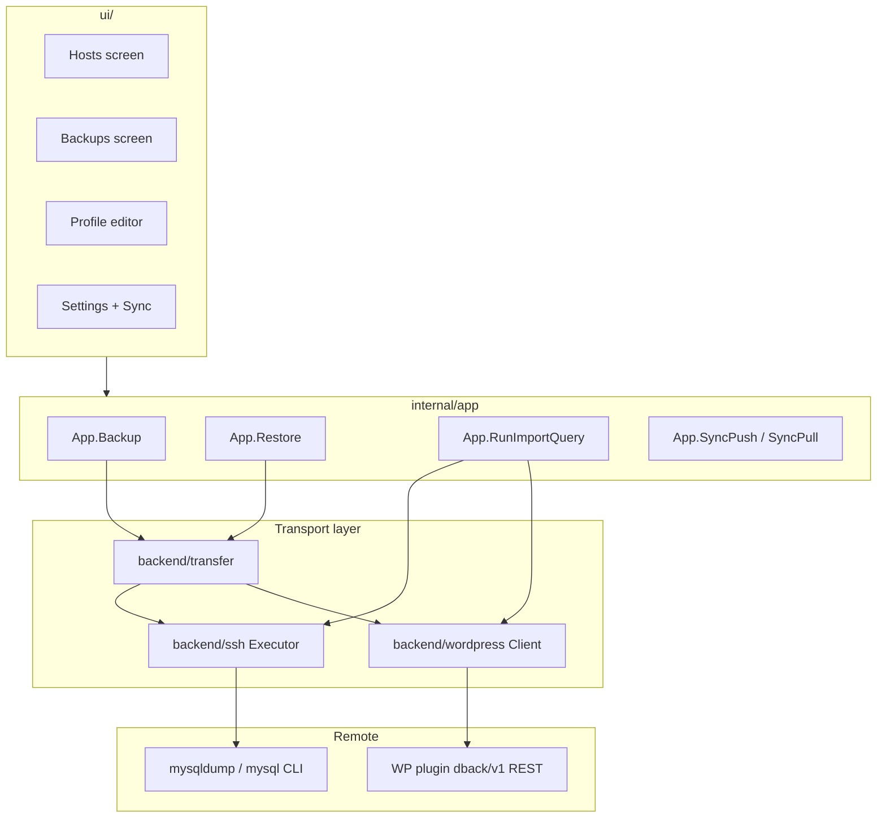

# DBack — Go Desktop App Agent Guide

This document is the **AI roadmap** for the DBack Go desktop application (`dback` module). Use it before exploring the whole repository. For the WordPress plugin REST agent, see [`wordpress/dback-db-tools/wordpress_agent.md`](wordpress/dback-db-tools/wordpress_agent.md).

---

## Purpose

DBack is a **Gio desktop app** (not a web server) for MySQL/MariaDB **backup, restore, and SQL queries** against remote hosts. Data (profiles, templates, history, logs, sync settings) lives in a **local encrypted vault**. Backup files (`.sql.gz`) are stored on disk under each host’s destination folder.

**Stack:** Go 1.25 · [Gio](https://gioui.org) UI · SSH/shell transport · WordPress REST plugin transport · MinIO S3 sync · Argon2id + AES-GCM vault.

---

## Repository map

```
dback/
├── main.go                         # Entry: embed logo, ui.New().Run()
├── agent.md                        # This file (Go app roadmap)
├── models/models.go                # Domain types: Profile, bundles, vault payload
├── ui/                             # Gio UI (screens, widgets, theme, state)
├── internal/
│   ├── app/                        # Business orchestration (Backup, Restore, sync, vault API)
│   ├── store/                      # Persistence, vault, import/export bundles
│   ├── sync/s3.go                  # S3-compatible push/pull
│   └── secrets/                    # Argon2id + AES-GCM
├── backend/
│   ├── ssh/                        # SSH, JumpHost, Localhost executor
│   ├── db/                         # Shell command builders, validation, query parsing
│   ├── transfer/                   # Backup/restore strategies
│   ├── preflight/                  # Remote preflight (SSH path)
│   └── wordpress/                  # REST client, plugin zip generation
└── wordpress/dback-db-tools/       # Embedded PHP plugin (see wordpress_agent.md)
```

**Runtime data directory:** `~/.config/dback` (via `ui.DesktopPlatform.AppDataDir()`).

| File | Role |
|------|------|
| `app_data.vault.json` | Encrypted vault (profiles, templates, history, logs, sync) |
| `ssh_known_hosts` | SSH host key store |
| `{Destination}/{HostName}/*.sql.gz` | Backup files (not in vault) |

---

## Architecture



**Layering rule:** UI never calls `backend/*` directly. Always go through `internal/app.App`.

---

## Connection types

Defined in `models/models.go`:

```go
ConnectionTypeSSH       = "SSH"
ConnectionTypeJumpHost  = "JumpHost"
ConnectionTypeLocalhost = "Localhost"
ConnectionTypeWordPress = "WordPress"
```

| Type | Transport | Backup | Import | Query | Preflight |
|------|-----------|--------|--------|-------|-----------|
| **SSH** | `ssh.Client` → shell | `transfer.BackupSSH` | `transfer.RestoreSSH` | `db.BuildQueryCommand` + executor | `preflight.Run` (remote bash) |
| **Jump Host** | SSH via bastion (`newJumpClient`) | Same; **tmp-file strategy first** | Same | Same | Same |
| **Localhost** | `LocalClient` → local/WSL bash | Same | Same | Same | Same |
| **WordPress** | HTTP REST `dback/v1` | `transfer.BackupWordPress` | `transfer.RestoreWordPress` | `wordpress.Client.Query` | `GET /preflight` |

**Branching in app layer** (`internal/app/app.go`):

```go
if profile.UsesWordPress() {
    // wordpress path
} else {
    // ssh.NewExecutor + transfer.BackupSSH / RestoreSSH
}
```

Helpers on `models.Profile`:

| Method | Meaning |
|--------|---------|
| `UsesSSH()` | SSH or JumpHost |
| `UsesWordPress()` | WordPress REST |
| `IsLocalhost()` | Local shell |
| `SupportsSQLQuery()` | MySQL/MariaDB, or WordPress |
| `AllowsImport()` | `!ImportProtected` |

---

## Profile fields by connection type

### Shared (all types)

| Field | Purpose |
|-------|---------|
| `ID`, `Name`, `Group` | Identity |
| `ConnectionType` | SSH / JumpHost / Localhost / WordPress |
| `TargetDBName` | DB name for filenames, query placeholders, WordPress import target |
| `Destination` | Local folder for backup files |
| `PreImportQuery`, `RunQueryBeforeImport` | SQL before restore |
| `PostImportQuery`, `RunQueryAfterImport` | SQL after restore |
| `ImportProtected` | Block restore to this host |
| `DBType` | `MySQL` or `MariaDB` (WordPress defaults to MySQL in UI) |

### SSH / Jump Host / Localhost

| Field | Notes |
|-------|-------|
| `Host`, `Port` | SSH target (hidden for Localhost) |
| `SSHUser`, `SSHPassword`, `AuthType`, `AuthKeyPath`, `AuthKeyPEM` | SSH auth |
| `JumpHost`, `JumpPort`, `JumpUser`, `JumpPassword`, `JumpAuthType`, `JumpAuthKeyPath`, `JumpAuthKeyPEM` | Jump Host only |
| `DBHost`, `DBPort`, `DBUser`, `DBPassword` | Remote DB (unless Docker) |
| `IsDocker`, `ContainerID` | `docker exec` path |

### WordPress

| Field | Notes |
|-------|-------|
| `WPUrl` | Site URL (`https://example.com`) |
| `WPKey` | API key → header `X-DBACK-KEY` |
| `Host` | Synced from `WPUrl` on save |
| DB credential fields | **Not used** — plugin uses wp-config |
| `TargetDBName` | Empty → WordPress default DB (`DB_NAME`); set → `X-DBACK-DATABASE` on import/query |

**Legacy (migration only, never written on save):** `ExportSettings`, `ImportSettings` — flattened by `store.flattenProfile`.

---

## Backup flow

### Entry points

| Layer | Symbol | File |
|-------|--------|------|
| UI | `UI.runBackup` | `ui/hosts.go` |
| App | `App.Backup` | `internal/app/app.go` |

### SSH / Jump / Localhost path

```
App.Backup
  → transfer.BackupSSH
    → db.ValidateProfileForRemoteOps
    → ssh.NewExecutor(profile)
    → preflight.Run(client, profile, 0, operationID)
    → estimateBackupTotal (optional progress)
    → mkdir {Destination}/{safeName(Name)}/
    → file: {TargetDBName}_{DD_MM_YYYY_HH_MM_SS}.sql.gz
    → strategies: streaming → tmp-file (JumpHost: tmp-file first)
    → validateBackupIntegrity, checksum
  → ExportRecord → vault history
```

**Strategies** (`backend/transfer/transfer.go`):

| Strategy | Behavior |
|----------|----------|
| `StrategyStreaming` | `RunCommandStream(BuildExportCommand)` → write local file |
| `StrategyTmpFile` | Remote dump to tmp → download with resume (`.meta` metadata) |

**Preflight** (`backend/preflight/`): OS, dump tools, gzip/zstd, disk space, Docker status, writable tmp dirs.

### WordPress path

```
App.Backup → transfer.BackupWordPress
  → client.Preflight (GET /preflight)
  → client.Export (GET /export) → stream gzip to local file
```

No tmp-file fallback. Plugin details: [`wordpress_agent.md`](wordpress/dback-db-tools/wordpress_agent.md).

### Validation

- Minimum backup size: **128 bytes** (app + transfer).
- Jump Host: prefer tmp-file — double SSH tunnel streaming is unreliable for large dumps.

---

## Import / restore flow

### Entry points

| Layer | Symbol | File |
|-------|--------|------|
| UI | `UI.runRestore` | `ui/backups.go` |
| App | `App.Restore` | `internal/app/app.go` |

### Order of operations

```
1. Check destination.AllowsImport()  (ImportProtected)
2. Pre-import query (optional)       → RunImportQuery, connectDB=false
3. transfer.RestoreSSH or RestoreWordPress
4. Post-import query (optional)      → RunImportQuery, connectDB=true
```

**Important:** Pre-import query failure is logged as **Warning** — restore **continues**. Post-import failure is also Warning only.

### SSH path

```
transfer.RestoreSSH
  → preflight.Run(client, profile, fileSize, operationID)
  → detectCompression (gzip / zstd magic)
  → BuildImportPrepareCommand: DROP + CREATE DATABASE (when applicable)
  → strategies: streaming (pipe stdin) → tmp-file upload + import from file
```

Key builders: `backend/db/commands.go` — `BuildImportStreamCommand`, `BuildImportFromFileCommand`, `BuildImportPrepareCommand`.

### WordPress path

```
transfer.RestoreWordPress
  → client.Preflight
  → client.Import(body, db.WordPressImportDatabase(profile))
```

Import body from `$request->get_body()` (not `php://input`). Target DB via `X-DBACK-DATABASE`.

---

## Query execution

### Entry points

| Context | Call chain |
|---------|------------|
| Host editor → Queries tab | `ui/query.go` → `App.RunImportQuery` |
| Pre/post import | `App.Restore` |
| Connection test (DB step) | `App.TestDatabaseConnection` |

### Paths

**WordPress:**

```
wordpress.NewClient(profile)
  → client.Query(ctx, sql, db.WordPressImportDatabase(profile))
  → POST /query + optional X-DBACK-DATABASE
  → JSON → db.QueryResult
```

**SSH / Jump / Localhost:**

```
db.BuildQueryCommand(profile, query, connectDB)  // base64 pipe, anti-injection
  → ssh.NewExecutor → RunCommand
  → db.ParseMySQLBatchOutput
```

**Placeholders** (`models.SubstituteQuery`): `{databasename}`, `{host}`, `{profile}`, `{dbuser}`.

**UI limits:** 100 rows, 20 columns (`ui/query.go`).

---

## Connection test

Two-step timeline (`ui/host_connection.go`):

| Step | SSH/Jump/Local | WordPress |
|------|----------------|-----------|
| Server | `echo dback-server-ok` via executor | `GET /ping` |
| Database | `SELECT 1` via mysql CLI | `SELECT 1` via REST query |

Labels: `serverConnectionStepLabel()` — Local shell / WordPress REST API / Server connection.

---

## S3 sync

| Item | Location |
|------|----------|
| S3 client | `internal/sync/s3.go` |
| App API | `internal/app/sync.go` — `SyncPush`, `SyncDownload`, `PreviewSyncImport`, `ImportAppDataFromBundle` |
| UI | `ui/settings_sync.go` |
| Model | `models.SyncSettings`, `models.SyncActivity` |

**Remote object:** `{bucket}/dback/app-data.json` (`sync.ObjectKey`).

**SyncSettings fields:** `Endpoint`, `Region`, `Bucket`, `AccessKeyID`, `SecretKey`, `UseSSL`.

### Push

```
App.SyncPush
  → store.MarshalAppDataBundleForSync (encrypt with vault master key)
  → sync.Push → PutObject
  → store.RecordSyncPush (local LastPushAt only)
```

### Pull

```
App.SyncDownload → sync.Pull
  → PreviewSyncImport / ImportAppDataFromBundle
  → merge profiles/templates + Reload
  → RecordSyncPull
```

**Included in sync bundle:** profiles, templates, history metadata, logs, sync credentials.  
**Excluded:** backup `.sql.gz` files, `SyncActivity` timestamps.

**Encryption:** Sync uses **vault master key** (unlock passphrase). Local file export uses a **separate export password** (`App.ExportAppData`).

---

## Vault and persistence

| Concern | File / symbol |
|---------|----------------|
| Vault file | `{baseDir}/app_data.vault.json` — `store.VaultPath()` |
| Payload | `models.AppVaultPayload` — profiles, templates, history, logs, sync |
| Crypto | `internal/secrets/` — Argon2id + AES-256-GCM |
| Lifecycle | `CreateVault`, `Unlock`, `Lock`, `Reload` — `internal/app/app.go` |
| Legacy migration | Plaintext JSON files → vault on first unlock |
| Secret stripping | `store.stripSecrets` — passwords, keys, `WPKey` on export without secrets |

**All store writes require unlocked vault** (`ErrVaultLocked` otherwise).

---

## WordPress plugin integration

| Item | Location |
|------|----------|
| Plugin source | `wordpress/dback-db-tools/` |
| Embed | `wordpress/dback-db-tools/embed.go` — `//go:embed` |
| Zip build | `backend/wordpress/pluginzip.go` — `BuildPluginZip(siteURL, apiKey)` |
| App facade | `internal/app/pluginzip.go` — `BuildWordPressPluginZip` |
| UI | Host form → Generate Token, Download Plugin — `ui/settings_form.go` |

Output filename: `dback-{hostname}-{pluginVersion}.zip`. Token hardcoded in `DBACK_HARDCODED_API_KEY` placeholder.

**REST contract:** namespace `dback/v1`, auth `X-DBACK-KEY`, optional `X-DBACK-DATABASE`. Full API: [`wordpress_agent.md`](wordpress/dback-db-tools/wordpress_agent.md).

---

## Adding a new host type — checklist

1. **Model** — `models/models.go`
   - Add `ConnectionType` constant
   - Add `Profile` fields if needed
   - Add `UsesX()`, update `SupportsSQLQuery()` if applicable

2. **Validation** — `backend/db/validate*.go`
   - `ValidateProfileForX`, wire into `ValidateProfileForOps`

3. **Transport**
   - Shell-based: extend `ssh.NewExecutor` or reuse it
   - HTTP/API-based: new package like `backend/wordpress` with a client

4. **Transfer** — `backend/transfer/`
   - `BackupX`, `RestoreX` using same `BackupRequest` / `RestoreRequest` types

5. **App orchestration** — `internal/app/app.go`
   - Branch in: `Backup`, `Restore`, `RunImportQuery`, `TestServerConnection`, `TestDatabaseConnection`

6. **Preflight**
   - SSH: extend `db.BuildPreflightScript` + `preflight.Run`
   - REST: new endpoint + client parser (WordPress pattern)

7. **Store** — `internal/store/store.go`
   - `normalizeProfile` defaults; do **not** filter out new type in `flattenProfiles`

8. **UI** — `ui/settings_form.go`
   - Add to `connTypeValues`
   - Conditional fields in `SettingsForm.layout`
   - Update `hostConnectionSubtitle` in `ui/helpers.go`
   - Update `serverConnectionStepLabel` in `ui/host_connection.go`

9. **Tests** — model helpers, store, client `httptest`, app integration

**Pattern to copy for HTTP hosts:** WordPress (`backend/wordpress/` + plugin embed).

**Pattern to copy for shell hosts:** Localhost (special case in `ssh.NewExecutor`).

---

## UI guidelines (Gio)

### Theme tokens — `ui/theme.go` (`AppTheme`)

| Token | Default | Use |
|-------|---------|-----|
| `Padding` | 24dp | Main content inset (`layoutContent`) |
| `CardPadding` | 20dp | Inside `card()` |
| `Gap` | 16dp | Vertical spacing — `vgap(theme)` |
| `SectionGap` | 28dp | Between major sections |
| `Radius` | 12dp | Cards |
| `RadiusSm` | 8dp | Inputs, small buttons |

**Colors:** GitHub dark palette — `Bg`, `Surface`, `Accent` (green), `Link` (blue), `Danger`, `Text`, `TextMuted`.

### Layout patterns

| Pattern | Where | How |
|---------|-------|-----|
| Desktop shell | `layoutDesktop` | 248dp sidebar + `Flexed(1)` content |
| Content padding | `layoutContent` | `Inset` with `theme.Padding` on all sides |
| Full-width content | Inside content | `gtx.Constraints.Min.X = gtx.Constraints.Max.X` |
| Centered modal/card | Login, dialogs | `layout.Center.Layout` + max width (e.g. 440dp) |
| Right-aligned actions | Profile footer | `Flexed(1)` empty spacer + buttons |
| Horizontal button groups | Forms | `layout.Flex{Axis: Horizontal}` + `hgap(theme)` |
| Scrollable forms | Profile editor | `scrollArea` + `widget.List` |

### Spacing helpers — `ui/widgets.go`

```go
vgap(theme)              // vertical Gap (16dp)
hgap(theme)              // horizontal Gap (16dp)
spacer(theme, unit.Dp(n)) // fixed vertical space
```

**Label → field gap:** 6dp inset in `labeledField`.

### Components — use existing, do not reinvent

| Component | Function | Notes |
|-----------|----------|-------|
| Card | `card(gtx, theme, widget)` | Surface + 1dp border, `CardPadding` |
| Primary button | `primaryButton(gtx, th, theme, &btn, label, onClick)` | Green accent |
| Secondary button | `secondaryButton(...)` | Outlined |
| Danger button | `dangerButton(...)` | Delete actions |
| Tab | `tabButton(...)` | Profile Connection / Queries |
| Text input | `editorField` inside `borderedInput` | Focus ring = `Link` color |
| Password | `passwordField` | Toggle visibility |
| Enum / dropdown | `enumField` | Connection type, DB type |
| Checkbox | `checkboxField` | Import protected, Docker |
| Muted help | `mutedLabel` | Secondary instructions |
| Section title | `sectionTitle` (H4) / `material.Subtitle1` in cards |
| Page header | `pageHeader(gtx, th, theme, title, action)` | Title left, action right |
| Dialog | `ui/dialog.go` | Overlay stack on main layout |
| Loading | `DialogLoading` | Long operations |

### Async UI pattern

- Long ops run in **goroutines** (`ui/jobs.go`, `hosts.go`, `backups.go`).
- Update UI via `u.invalidate()` after state changes.
- Use `operationJob` for cancel + progress.
- Never block the Gio event loop.

### Platform

- `ui/platform.go` — `Platform` interface (`AppDataDir`, `OpenFolder`, `IsMobile`).
- File picks: `ui/explorer.go` — `pickOpenFile`, `pickSaveFile`, `pickSaveBytes`, `pickFolder`.

### UI do's and don'ts

**Do:**

- Reuse `AppTheme` tokens for all spacing — no magic numbers unless one-off (e.g. login 20dp spacer).
- Wrap related fields in `card()`.
- Hide irrelevant fields by connection type (see `SettingsForm.layout` pattern with `isWordPress`, `isLocal`, `isJump`).
- Call `u.core.*` app methods from UI — never import `backend/*` in UI for operations.
- Use `secondaryButton` for secondary actions, `primaryButton` for main CTA.

**Don't:**

- Add raw `material.Button` without theme colors.
- Hardcode colors outside `AppTheme`.
- Run SSH/HTTP on the UI thread.
- Duplicate vault or transfer logic in UI.

---

## Build and embed

| Item | Location |
|------|----------|
| Logo | `main.go` — `//go:embed logo.png` |
| Version | `-ldflags "-X main.appVersion=..."` — `build.sh`; default `3.2.0` |
| Plugin embed | `wordpress/dback-db-tools/embed.go` |
| Linux build | `build.sh` — CGO + Gio/EGL |

---

## Key symbols quick reference

| Concern | Primary symbols | File |
|---------|-----------------|------|
| Backup | `App.Backup`, `transfer.BackupSSH`, `transfer.BackupWordPress` | `internal/app/app.go`, `backend/transfer/` |
| Restore | `App.Restore`, `transfer.RestoreSSH`, `transfer.RestoreWordPress` | same |
| Query | `App.RunImportQuery`, `db.BuildQueryCommand`, `wordpress.Client.Query` | `internal/app/app.go`, `backend/db/`, `backend/wordpress/` |
| Executor | `ssh.NewExecutor`, `ssh.NewClient`, `LocalClient` | `backend/ssh/executor.go` |
| Commands | `BuildExportCommand`, `BuildImportStreamCommand`, `BuildPreflightScript` | `backend/db/commands.go` |
| Vault | `Store.Unlock`, `Store.SaveProfiles` | `internal/store/` |
| Sync | `App.SyncPush`, `sync.Push` | `internal/app/sync.go`, `internal/sync/s3.go` |
| UI shell | `UI.layout`, `Section`, `View` | `ui/app.go`, `ui/state.go` |
| Profile model | `models.Profile`, `ConnectionType` | `models/models.go` |

---

## Hard constraints (do's and don'ts)

### Do

- Branch **WordPress vs non-WordPress** at `internal/app` using `profile.UsesWordPress()`.
- Use **`ssh.NewExecutor(profile)`** as the single shell entry for SSH/Jump/Localhost.
- Run **preflight** before backup/restore on SSH path.
- **Mask commands** in logs: `db.MaskCommand`.
- **Substitute query placeholders** before execution.
- Respect **`context.Context`** — close SSH on cancel.
- Clear legacy **`ExportSettings` / `ImportSettings`** on save.
- Validate **minimum backup size** (128 bytes).
- Use **tmp-file-first** for Jump Host backups.
- Keep **vault locked** checks on all store access.
- Pass **`X-DBACK-DATABASE`** for WordPress import and query when `TargetDBName` is set.

### Don't

- Don't call `ssh.NewClient` directly from app code — use `NewExecutor`.
- Don't write `ExportSettings`/`ImportSettings` on save (migration only).
- Don't **abort restore** on pre-import query failure.
- Don't include **backup files** in app bundles or S3 sync.
- Don't include **SyncActivity** in remote sync payload.
- Don't skip **`ImportProtected`** check before restore.
- Don't interpolate SQL into shell — use **base64 pipe** in `BuildQueryCommand`.
- Don't assume streaming works through **double SSH tunnel** (Jump Host).
- Don't add connection-type logic **only in UI** — mirror in app + transfer/backend.
- Don't read **`php://input`** in WordPress plugin for REST import — use `$request->get_body()`.
- Don't trust **`wpdb->select()` return value** on modern WordPress — it returns `null` on success; verify with `$wpdb->ready` and `SELECT DATABASE()`.

---

## Testing

```bash
go test ./...
```

Key test locations:

| Area | Path |
|------|------|
| WordPress client | `backend/wordpress/client_test.go` |
| Transfer / validate | `backend/transfer/*_test.go` |
| Store / vault | `internal/store/store_test.go` |
| UI helpers | `ui/helpers_test.go`, `ui/filters_test.go` |

---

## Related documentation

| Document | Scope |
|----------|-------|
| [`wordpress/dback-db-tools/wordpress_agent.md`](wordpress/dback-db-tools/wordpress_agent.md) | PHP plugin REST API, export/import/query, auth, constraints |
| [`README.md`](README.md) | User-facing features and setup |

---

## Version note

When this doc and code diverge, **trust the code** and update this file. Last aligned with WordPress host support, `X-DBACK-DATABASE`, and embedded plugin zip flow.
