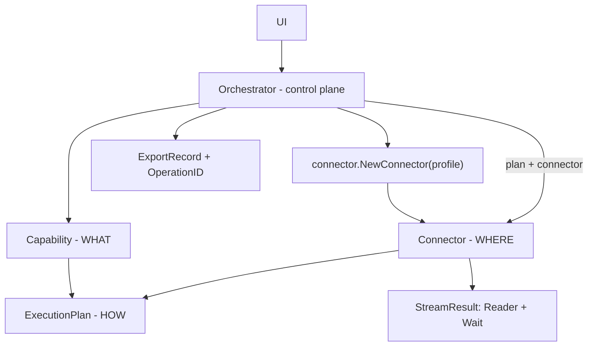
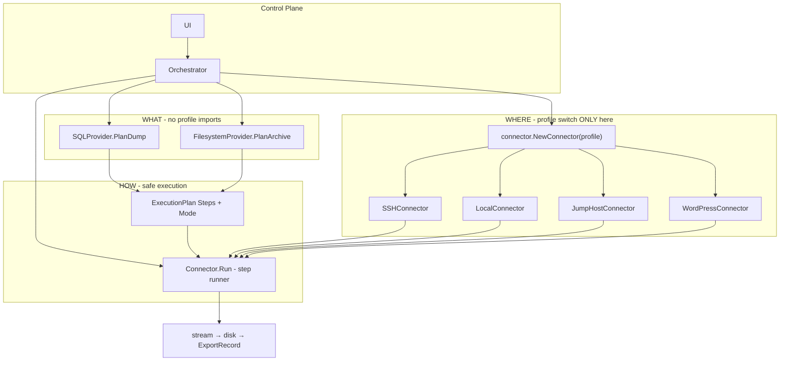

# بکاپ فایل برای DBack — Control Plane Architecture

## Vision

DBack = **Control Plane**، نه Backup Engine.

```text
UI → Orchestration → Capability → Connector → Execution
```

همان الگوی Kubernetes controller / Terraform / Argo: **declarative intent** + **execution adapter**.

| Layer | سؤال | مسئولیت |
|-------|------|---------|
| **UI** | کاربر چه می‌خواهد؟ | hosts, paths, triggers |
| **Orchestrator** (`internal/app`) | workflow چیست؟ | jobs, history, verify, OperationID |
| **Capability** | **WHAT** to backup? | SQL dump plan, tar archive plan |
| **Connector** | **WHERE/HOW** to execute? | SSH, Local, Jump, HTTP (WP) |
| **ExecutionPlan** | **HOW** safely? | structured steps — no shell strings |

---

## تصمیم‌های اولیه (ثبت‌شده)

| موضوع | انتخاب |
|-------|--------|
| اتصال file backup | SSH، Jump Host، Localhost |
| تاریخچه | لیست مشترک + فیلتر ExportType |
| Backup Files | sequential، یک job، OperationID مشترک |
| Restore | v1 خیر |
| Exclude | global per-host |

---

## Guardrail A — Capability + Connector (دو لایه جدا)

### ❌ anti-pattern (حذف از طرح)

```text
SQLProvider → resolve based on profile
FilesystemProvider → resolve based on profile
```

این پنهاناً برمی‌گردد به:

```go
if profile.ConnectionType == WordPress { ... }
if profile.ConnectionType == SSH { ... }
```

### ✔ separation درست

**Capability** فقط می‌گوید **چه** اجرا شود — بدون دانستن SSH/Local/Jump:

```go
// internal/capability/filesystem.go
type FilesystemProvider interface {
    PlanArchive(opts ArchiveOptions) (shell.ExecutionPlan, error)
}
```

**Connector** فقط می‌گوید **کجا/چطور** اجرا شود:

```go
// internal/connector/connector.go
type Connector interface {
    Run(ctx context.Context, plan shell.ExecutionPlan) (*shell.StreamResult, error)
    Close() error
}
```

Implementations:

- `SSHConnector` — wraps [`backend/ssh`](backend/ssh)
- `LocalConnector` — local processes
- `JumpHostConnector` — bastion tunnel
- `WordPressConnector` — خارج از v1؛ مسیر DB WordPress فعلی در v1 دست نمی‌خورد

### ✔ تنها جای switch روی profile

```go
// internal/connector/factory.go  ← ONLY profile→connector mapping
func NewConnector(profile models.Profile) (Connector, error)
```

**Capability layer هیچ import از `models.Profile.ConnectionType` ندارد.**

Orchestrator flow for **file backup v1**:

```go
plan, err := filesystemProvider.PlanArchive(opts)   // WHAT
conn, err := connector.NewConnector(profile)         // WHERE (factory only)
result, err := conn.Run(ctx, plan)                   // HOW
_, copyErr := copyToFile(result.Reader)
waitErr := result.Wait()
```



**قانون طلایی:** Provider = capability name. Connector = transport name. **هرگز capability بر اساس profile resolve نشود.**

**v1 wiring:**

- `TarArchiveCapability` → `PlanArchive` (tar + compress steps)
- Existing DB behavior → **unchanged** (no capability/connector migration in v1)
- File backup → `PlanArchive` + SSH/Local/Jump connector

---

## Guardrail B — Identity: ID truth, Name mutable, CanonicalKey grouping

### ❌ اصلاح قبلی (اشتباه)

`CanonicalKey = system truth` + stored immutable → اگر `Name` عوض شود، key stale می‌ماند.

### ✔ مدل production-safe

```go
type FileBackupPath struct {
    ID           string `json:"id"`            // REAL identity — stable forever
    Name         string `json:"name"`          // REQUIRED — mutable UI label
    RemotePath   string `json:"remote_path"` // REQUIRED — mutable execution target
    CanonicalKey string `json:"canonical_key"` // derived grouping key — NOT identity
}
```

| Field | نقش |
|-------|-----|
| **ID** | identity واقعی — history link، dedup منطقی |
| **Name** | label قابل ویرایش — UI، jobs، SourceLabel snapshot |
| **RemotePath** | execution target — قابل ویرایش |
| **CanonicalKey** | `slug(Name)` — فقط grouping/filename hint در config فعلی |

**Normalize on save:**

```go
func (p *FileBackupPath) Normalize() error {
    // Name, RemotePath required
    p.CanonicalKey = slugCanonical(p.Name) // regenerated every save when Name changes
    return nil
}
```

**Validation:**

- `Name` empty → reject
- `RemotePath` empty → reject
- duplicate `CanonicalKey` in same profile → reject (UX: two paths can't share same display slug)
- duplicate `ID` → impossible if UUID/nano id

**History snapshot** (immutable at backup time):

```go
// ExportRecord
FileBackupPathID string // links to config ID
SourceLabel      string // snapshot of Name at backup time
SourcePath       string // snapshot of RemotePath at backup time
CanonicalKey     string // snapshot at backup time — for display/group only
```

Rename `Name` بعداً → history قدیمی `SourceLabel` قدیمی را نگه می‌دارد؛ config جدید `CanonicalKey` جدید می‌گیرد.

**Filename at backup time:**

```
files/{SafeLabel(slug(SourceLabel))}_{timestamp}.{ext}
```

از **snapshot** — نه از config mutable.

**قوانین UI:**

- Paths list / Jobs: **Name** (never merge with path in list view)
- History: **SourceLabel** (snapshot)
- Internal refs: **FileBackupPathID**

**قانون طلایی:** ID = identity. Name = mutable label. CanonicalKey = grouping helper. Path = execution.

---

## Guardrail C — ExecutionPlan (نه PipeTo + SerializeForSSH)

### ❌ hole در طراحی قبلی

`PipeTo *Command` + `SerializeForSSH()` → هنوز string shell با pipe → ~70% ریسک باقی.

### ✔ production-grade (minimal)

```go
// backend/shell/plan.go
type ExecutionMode int

const (
    ModeRemotePipe   ExecutionMode = iota // connector wires step stdout→next stdin
    ModeLocalPipe
)

type Command struct {
    Binary string
    Args   []string
    // NO PipeTo — pipeline expressed in plan steps
}

type ExecutionPlan struct {
    Steps []Command
    Mode  ExecutionMode
}
```

**Builder** ([`backend/builder/tar.go`](backend/builder/tar.go)):

```go
func BuildTarArchivePlan(rootPath string, excludes []string, compress Command) ExecutionPlan {
    return ExecutionPlan{
        Mode: ModeRemotePipe,
        Steps: []Command{
            {Binary: "tar", Args: tarArgs...},
            compress, // {Binary: "zstd", Args: []string{"-1"}}
        },
    }
}
```

**Connector = step runner** — نه full shell string builder:

```go
type StreamResult struct {
    Reader io.ReadCloser
    Stderr io.Reader
    Wait   func() error
}

func (c *SSHConnector) Run(ctx context.Context, plan ExecutionPlan) (*StreamResult, error) {
    switch plan.Mode {
    case ModeRemotePipe:
        return c.runPipedRemote(ctx, plan.Steps) // Go io.Pipe between step stdout and next stdin
    ...
    }
}
```

- **هیچ full pipeline string** مثل `tar ... | zstd ...` ساخته نمی‌شود.
- هر step جدا اجرا می‌شود: `ExecStep(Command{Binary:"tar", Args:[...]})` و `ExecStep(Command{Binary:"zstd", Args:[...]})`.
- `LocalConnector` واقعاً با `exec.CommandContext(binary, args...)` اجرا می‌کند.
- `SSHConnector` روی vanilla SSH ناچار است برای **همان یک step** command string بسازد؛ این serialization محدود، مرکزی، و argv-safe است. تفاوت مهم: shell pipe، redirect، concat و user-input interpolation وجود ندارد.
- اگر بعداً remote helper/agent اضافه شود، همین API می‌تواند true argv exec بدهد بدون تغییر capability/orchestrator.
- user input فقط در `Args[]`؛ exclude patterns validated (no `;`, `` ` ``, `$()`)
- `Wait()` بعد از copy حتماً صدا زده می‌شود تا exit status آخر stream گم نشود.

**File backup v1:** 100% ExecutionPlan + Connector step runner + waitable stream.

**DB backup (موجود):** [`backend/db/commands.go`](backend/db/commands.go) و مسیر فعلی [`internal/app/app.go`](internal/app/app.go) بدون migration در v1. migrate به ExecutionPlan در PR جدا، بعد از پایدار شدن file backup.

**قانون طلایی:** ساختن command string برای کل pipeline ممنوع است. serialization محدود per-step در SSH قابل قبول است، به شرط اینکه فقط از `Binary + Args[]` ساخته شود و تنها نقطهٔ مجاز آن connector باشد.

---

## مدل داده (خلاصه)

### ExportType + VerificationMethod

```go
type ExportType string // database, files, (future...)
type VerificationMethod string // none, sha256, metadata, quick, deep
```

### Profile — File Backup (host-level)

```go
FileBackupEnabled, FileBackupDestination, FileBackupCompression, FileBackupExclude
FileBackupPaths []FileBackupPath
```

### ExportRecord — generic

```go
ExportType, FileBackupPathID, SourceLabel, SourcePath, CanonicalKey
OperationID, JobSequence, VerificationMethod
```

Legacy: `ExportType` empty → `database`.

---

## ساختار پکیج

```
backend/
  shell/
    command.go       # Command struct
    plan.go          # ExecutionPlan + ExecutionMode
    stream.go        # StreamResult: Reader + Stderr + Wait
    plan_test.go
  builder/
    label.go         # SafeLabel for filenames
    tar.go           # BuildTarArchivePlan
  archiver/
    archiver.go      # CompressCommand() → Command
internal/
  connector/
    connector.go     # Connector interface
    factory.go       # NewConnector(profile) — ONLY profile switch
    ssh.go, local.go, jump.go
  capability/
    filesystem.go    # FilesystemProvider — PlanArchive only
  app/
    file_backup.go   # control plane for file backups: plan → connector → history
models/
  filebackup.go      # Normalize, slug, validation
```

---

## Orchestrator — File Backup flow

1. Validate profile paths (IDs unique, Names required, CanonicalKeys unique)
2. `connector := NewConnector(profile)` — **once per job**
3. `OperationID := newID()`
4. For each `FileBackupPath` (by order):
   - `plan := filesystemProvider.PlanArchive(opts{Root, Excludes, Compression})`
   - `result := connector.Run(ctx, plan)`
   - copy `result.Reader` → `{dest}/{host}/files/{SafeLabel(slug(Name))}_{ts}.ext.partial`
   - call `result.Wait()` after copy
   - if copy + wait succeed: rename `.partial` → final file، then SHA256
   - `ExportRecord{ ExportType: files, FileBackupPathID, SourceLabel: Name, ... }`
5. Save history

Progress: `2/5 · Uploads · 45%` + bytes/speed.

### Partial failure policy

v1 policy is **stop on first failed path**:

- مسیرهای موفق قبلی record می‌گیرند و در history ذخیره می‌شوند.
- مسیر failed هیچ `ExportRecord` موفق نمی‌گیرد؛ فقط job sub-item با error نشان داده می‌شود.
- job parent status: `partial_failed` اگر حداقل یک مسیر موفق شده باشد، و `failed` اگر هیچ مسیر موفق نشده باشد.
- `.partial` file در failure پاک می‌شود مگر بعداً resume اضافه شود.
- ادامه‌دادن بعد از خطا (`continue on error`) خارج از v1 است.

Reason: این رفتار برای backup قابل اعتمادتر است و از این جلوگیری می‌کند که user فکر کند همهٔ استراتژی کامل انجام شده، درحالی‌که بخشی از مسیرها fail شده‌اند.

---

## UI (بدون تغییر ساختاری)

```
Database Backup → Destination
File Backup → Enabled, Destination, Compression, Exclude
Paths → Name (required) + Remote Path (required) + [+/−]
```

Hosts: Backup + Backup Files | Backups: Type filter, SourceLabel | Jobs: SubItems grouped by OperationID

---

## تست (guardrail-focused)

| فایل | پوشش |
|------|------|
| `internal/connector/factory_test.go` | profile types map to connectors; capability packages don't import ConnectionType |
| `backend/shell/plan_test.go` | Steps structure; no `PipeTo`; no full pipeline command string |
| `internal/connector/ssh_pipe_test.go` | per-step remote execution; no `tar ... | zstd ...`; `Wait()` error propagated |
| `internal/connector/stream_result_test.go` | copy succeeds but `Wait()` fails → backup fails and `.partial` removed |
| `models/filebackup_test.go` | ID stable; Name rename regenerates CanonicalKey; history snapshot unchanged |
| `internal/app/orchestrator_test.go` | OperationID grouping, FileBackupPathID in records, stop-on-first-failure policy |

---

## خارج از scope (v1)

- Restore فایل
- ContainerProvider
- DB commands → ExecutionPlan migration
- WordPressConnector / WordPress file backup
- Incremental backup

## ریسک‌های operational (غیر معماری)

- tar stream: BytesTotal indeterminate — speed از rolling window
- Linux remote only برای tar `--exclude`

---

## Diagram — Control Plane (final)


