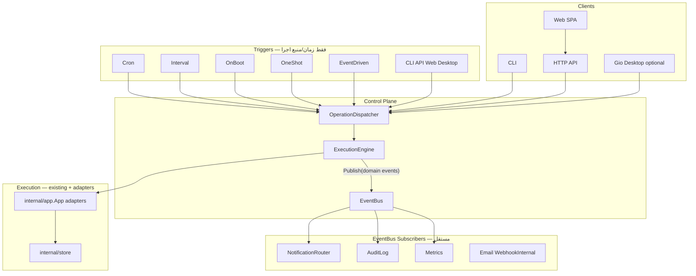
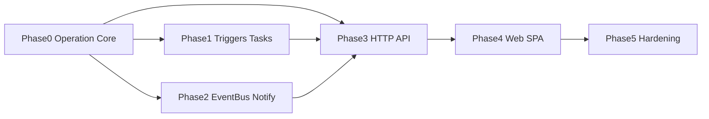

# DBack Control Plane — Roadmap رسمی (Server + Schedule + Web + Notify)

## Vision

DBack = **Control Plane** برای اجرای **Operation**ها (backup، upload، verify، sync، …) — نه فقط «اپ backup دسکتاپ».

```
Core (Operations + Engine)
        ↓
      API  ← product (CLI remote, SDK, Terraform, K8s operator, mobile)
        ↓
      Web  ← UI اصلی (مدیریت سرور)
        ↓
   Desktop (Gio) ← optional / legacy — احتمال حذف در بلندمدت
```

---

## وضعیت فعلی (baseline)

| لایه | وضعیت | فایل‌های کلیدی |
|------|--------|----------------|
| Backup engine | آماده | [`internal/app/app.go`](internal/app/app.go), [`file_backup.go`](internal/app/file_backup.go), [`remote_upload.go`](internal/app/remote_upload.go) |
| Persistence | Vault رمزنگاری‌شده | [`models/models.go`](models/models.go), [`internal/store/`](internal/store/) |
| Desktop UI | Gio — اجرای دستی operation + job/progress درون‌پردازه‌ای | [`ui/`](ui/) (~47 فایل؛ از جمله `hosts.go`, `jobs.go`, `backups.go`) |
| Entry | فقط GUI | [`main.go`](main.go) |
| Web assets | برای Control Plane وجود ندارد؛ JS افزونه WordPress خارج از scope است | [`wordpress/dback-db-tools/assets/admin.js`](wordpress/dback-db-tools/assets/admin.js) |
| Server config | فقط `DBACK_DEBUG` موجود است؛ envهای daemon هنوز پیاده نشده‌اند | [`internal/debug/debug.go`](internal/debug/debug.go) |
| Operation / Trigger / API / EventBus | **وجود ندارد** | — |

**نتیجه:** موتور backup در `internal/app` reuse می‌شود؛ لایه جدید **Operation + Dispatcher + Trigger + EventBus** روی آن ساخته می‌شود.

---

## معماری هدف (revision)

### اصل مرکزی: همه چیز Operation است

Backup، Upload، Verify، Cleanup، Sync و RestoreTest همگی **Operation** با spec یکسان و **typed params** هستند. Notification رویدادمحور subscriber است و فقط `notify test` command/API جدا دارد:

```go
// internal/operation/types.go
type Kind string // backup_db, backup_files, upload, verify_quick, ...

// Spec — discriminated union per Kind (typed at compile time where possible)
type Spec struct {
    ID         string // generated once by Dispatcher and injected into app adapters
    Kind       Kind
    ProfileID  string
    TriggerRef string // cli, api, task:ID, cron:ID
    Params     Params // interface — see below
}

// Params is implemented by one struct per Operation Kind
type Params interface {
    Kind() Kind
    Validate() error
}

type BackupDBParams struct{}
func (BackupDBParams) Kind() Kind { return KindBackupDB }

type BackupFilesParams struct{}
type UploadParams struct {
    RecordIDs  []string // optional filter
    UploadAll  bool
    StalePolicy UploadStalePolicy // new_only, latest_only, all_stale, fail
}
// ... verify_quick, sync_push, etc.

type Result struct {
    OperationID string
    Kind        Kind
    Status      Status
    StartedAt, FinishedAt time.Time
    Error       string
    Artifacts   []Artifact // typed: ExportRecordID, FilePath, ...
}
```

**قانون‌ها:**

- `ProfileID` فقط در `Spec` است؛ params نباید scope را تکرار کند.
- `Dispatcher` یک `OperationID` یکتا (UUID/ULID) می‌سازد و adapterها همان ID را به `internal/app` تزریق می‌کنند؛ متدهای فعلی که داخل خود `newID()` می‌سازند refactor می‌شوند تا log/history/event همگی یک correlation ID داشته باشند.
- `OperationRegistry` فقط `Params` معتبر همان `Kind` را می‌پذیرد. JSON/API boundary با explicit DTO + `Validate()` — **بدون** `map[string]any` در core path.

**Persistence boundary:** interface مستقیماً persist نمی‌شود. Task `ActionSpec` در vault به‌صورت `{ "operation": "backup_db", "params": { ... } }` با `json.RawMessage` ذخیره می‌شود؛ registry بر اساس `operation` آن را به typed `Params` deserialize و validate می‌کند. API DTO نیز همین boundary صریح را دارد.

**همه entry pointها فقط می‌گویند:** `Run Operation X`

| Entry | مثال |
|-------|------|
| CLI | `dback run operation backup_db --profile p1` |
| Cron Trigger | Task با action `backup_db` |
| API | `POST /api/v1/operations` |
| Web UI | دکمه Backup → همان API |
| Desktop (Gio) | adapter → Dispatcher (نه مستقیم `App.Backup`) |
| آینده: Queue / K8s Job / RabbitMQ | همان Dispatcher |

### لایه‌ها



**تفاوت با نسخه قبلی پلن:**

| موضوع | قبل (ضعیف) | بعد (درست) |
|-------|------------|------------|
| Scheduler | داخل runtime، مستقیم JobRunner | **Trigger** جدا — فقط fire می‌کند |
| JobRunner | backup-specific | **ExecutionEngine** — هر Operation |
| EventBus | hook روی JobRunner | **مستقل** — publish/subscribe |
| API | backend برای SPA | **Product** — SDK/mobile/TF/K8s |
| Web | parity با Gio | **UI اصلی** — Core→API→Web |
| Schedule model | `BackupSchedule` + Cron | **Task** = Trigger + Action(s) |
| Notify config | `map[string]string` | **Provider + Schema + Validation** |

---

## مدل داده — Task / Trigger / Action

به‌جای `BackupSchedule`، از ابتدا generic:

```go
// models/task.go

type Task struct {
    ID          string
    Name        string
    Enabled     bool
    Trigger     TriggerSpec
    Actions     []ActionSpec   // ordered — chain
    ProfileIDs  []string       // scope; empty is invalid in v1 (explicit scope only)
    OverlapPolicy OverlapPolicy // v1: skip; queue/cancel_previous reserved for later
    MaxConcurrentProfiles int  // default 1; bounded fan-out
}

type TriggerSpec struct {
    Type     TriggerType // cron, interval, one_shot, on_boot, event
    Cron     *CronTrigger     // expr + timezone
    Interval *IntervalTrigger // every 6h
    OneShot  *OneShotTrigger  // 2026-08-01T02:00:00
    OnBoot   *OnBootTrigger   // delay after daemon start
    Event    *EventTrigger    // e.g. after verify_success
}

type ActionSpec struct {
    Operation Kind
    Params    json.RawMessage // persisted DTO; registry decodes to typed Params
}

type TaskRunRecord struct {
    ID, TaskID, ProfileID string
    TriggerType TriggerType
    StartedAt, FinishedAt time.Time
    Status string
    ActionResults []ActionResult
}
```

**Chain v1 (مثال):**

```
Trigger: cron 0 2 * * *
Actions:
  1. backup_db
  2. backup_files
  3. upload
  4. (implicit via EventBus) notify subscribers
```

Persist در `AppVaultPayload`: `Tasks []Task`, `TaskRuns []TaskRunRecord` (cap N اخیر).

### قواعد chain و fan-out در v1

- هر fire یک `TaskRunRecord` به‌ازای هر profile می‌سازد؛ actionها به‌ترتیب و با `ProfileID` ارث‌برده از همان run اجرا می‌شوند.
- `MaxConcurrentProfiles` جلوی resource storm را می‌گیرد؛ مقدار پیش‌فرض `1` است.
- `ChainContext` artifactهای typed هر step را نگه می‌دارد. `upload` به‌صورت پیش‌فرض فقط `ExportRecordID`های تولیدشده توسط stepهای backup همان run را می‌گیرد؛ برای recordهای قدیمی باید params صریح داده شود.
- v1 روی اولین failure متوقف می‌شود؛ result stepهای قبلی حفظ می‌شوند و notification از event نهایی chain ساخته می‌شود.
- profile auto-upload فعلی قابلیت desktop است؛ Task دارای action صریح `upload` دوباره auto-upload را اجرا نمی‌کند.
- `backup_files` برای WordPress و هر ترکیب ناسازگار هنگام Save Task reject می‌شود، نه هنگام اجرای schedule.

### lifecycle و restart trigger در v1

- state حداقلی trigger شامل `LastFiredAt`, `NextRunAt` و `LastRunStatus` است.
- cron/interval در downtime **catch-up نمی‌شوند** و از زمان فعلی next run را محاسبه می‌کنند.
- `one_shot` پس از اجرای موفق disable می‌شود؛ اگر در downtime گذشته باشد یک بار در startup اجرا می‌شود، مگر اینکه قبلاً `LastFiredAt` داشته باشد.
- `on_boot` بعد از unlock موفق و ready شدن engine، با delay تنظیم‌شده، فقط یک بار در هر process start اجرا می‌شود.
- timezone باید IANA باشد؛ DST مطابق کتابخانه cron است و با fake clock تست می‌شود.
- CRUD تسک، registry را به‌صورت atomic resync می‌کند؛ task نامعتبر یا profile حذف‌شده با `task.skipped` ثبت می‌شود.

---

## OperationDispatcher + ExecutionEngine

پکیج [`internal/controlplane/`](internal/controlplane/):

```go
type OperationDispatcher interface {
    Submit(ctx context.Context, spec Spec) (*OperationRecord, error)
    RunChain(ctx context.Context, specs []Spec) (*ChainResult, error)
}

type ExecutionEngine struct {
    app       *app.App
    bus       event.Bus
    registry  OperationRegistry  // Kind → handler
    locks     ProfileLockTable   // overlap per profile/kind
}
```

- **Dispatcher:** validation، id generation (`OperationID`)، enqueue/sync policy، publish lifecycle events
- **Engine:** اجرای handler — adapter به `App.Backup`, `App.BackupFiles`, `App.UploadProfileBackups`, …
- **هیچ Trigger** مستقیم `App` را صدا نمی‌زند
- **v1 execution:** یک bounded worker queue درون‌پردازه‌ای با ظرفیت و concurrency قابل تنظیم؛ API/Trigger ابتدا `OperationRecord` را persist می‌کند و سپس `202 + OperationID` می‌گیرد. queue خارجی جزو v1 نیست.
- **OperationRecord:** وضعیت `queued/running/succeeded/failed/canceled`، timestamps، progress summary و result/error sanitized را نگه می‌دارد تا `GET /operations/{id}` بعد از restart قابل اتکا باشد.
- **Cancellation:** `POST /operations/{id}/cancel` context همان execution را cancel می‌کند؛ shutdown ورودی جدید را متوقف و تا timeout عملیات جاری را drain/cancel می‌کند.

استخراج از [`ui/hosts.go`](ui/hosts.go): `runBackup` / `runFileBackup` / `maybeAutoRemoteUpload` → `Dispatcher.Run` / `RunChain`.

استخراج فقط محدود به `hosts.go` نیست؛ entry pointهای restore/verify در `ui/backups.go` و `ui/verify.go` و sync در `ui/settings_sync.go` inventory می‌شوند. Gio فقط view adapter می‌ماند.

---

## EventBus — مستقل از Engine (Typed Events)

پکیج [`internal/event/`](internal/event/):

**اصل:** Event payload **typed** است — نه `map[string]any`. در Go از interface + struct per event type استفاده می‌شود.

```go
// Envelope — metadata مشترک
type Envelope struct {
    ID          string
    Type        Type      // operation.started, operation.completed, ...
    OperationID string
    Kind        operation.Kind
    ProfileID   string
    Timestamp   time.Time
}

// Event — هر event type interface خودش را implement می‌کند
type Event interface {
    EventType() Type
    Metadata() Envelope
}

// Typed payloads — one struct per event
type OperationStarted struct {
    Envelope
    Spec operation.Spec
}

type OperationCompleted struct {
    Envelope
    Result operation.Result
}

type OperationFailed struct {
    Envelope
    Result operation.Result
    Cause error // internal only; API/notify receives sanitized ErrorDTO
}

type OperationProgress struct {
    Envelope
    Phase      string
    Current    int64
    Total      int64
    Message    string
    SubItem    *SubItemProgress
}

type TaskSkipped struct {
    Envelope
    TaskID   string
    Reason   SkipReason // overlap, disabled, ...
}

type Bus interface {
    Publish(ctx context.Context, ev Event) error
    Subscribe(t Type, handler func(ctx context.Context, ev Event) error) (unsubscribe func())
}
```

**Subscriber pattern:** هر subscriber با type switch یا registry per `EventType` — compile-time safe extensions:

```go
func (r *NotifyRouter) Handle(ctx context.Context, ev event.Event) error {
    switch e := ev.(type) {
    case event.OperationCompleted:
        return r.onSuccess(ctx, e)
    case event.OperationFailed:
        return r.onFailure(ctx, e)
    default:
        return nil
    }
}
```

**API/SSE boundary:** typed Event → JSON DTO (`api/v1/event_dto.go`) — یک لایه mapping صریح، نه generic map.

**Engine فقط Publish می‌کند** — نه Notify، نه Audit.

**Semantics v1:**

- Bus درون‌پردازه‌ای و non-durable است؛ source of truth وضعیت، `OperationRecord`/`TaskRunRecord` persisted است.
- subscriberها buffer محدود دارند؛ handler کند execution را block نمی‌کند و drop/error آن metric/log می‌شود.
- SSE فقط live است، heartbeat و reconnect backoff دارد؛ client بعد از reconnect وضعیت نهایی را از Operations API sync می‌کند.
- callbackهای progress موجود در DB backup، file backup و upload به `operation.progress` map می‌شوند؛ throttle می‌شوند تا vault/SSE با هر byte update نشود.

Subscribers (قابل افزودن بدون تغییر Engine):

| Subscriber | نقش |
|------------|-----|
| `notify.Router` | Telegram, Slack, Bale, Webhook |
| `audit.Writer` | تغییرات config + operation summary (فاز 5) |
| `metrics.Collector` | Prometheus-style (فاز 5) |
| آینده: Email, PagerDuty | فقط subscriber جدید |

---

## Notification — Provider + Schema + Validation

به‌جای `Config map[string]string` خام:

```go
// internal/notify/channel.go
type Channel struct {
    ID       string
    Name     string
    Provider ProviderID // telegram, slack, bale, webhook
    Enabled  bool
    Events   []event.Type
    Config   json.RawMessage // validated against provider schema
}

type ProviderDefinition struct {
    ID     ProviderID
    Schema ConfigSchema   // JSON Schema or typed struct
    Send   func(context.Context, Config, Message) error
}
```

| Provider | فیلدهای schema (v1) |
|----------|---------------------|
| **Telegram** | `token`, `chat_id`, `thread_id?`, `parse_mode?` |
| **Slack** | `webhook_url`, `channel?`, `username?`, `icon_emoji?` |
| **Bale** | `token`, `chat_id` |
| **Webhook** | `url`, `method`, `headers`, `timeout`, `retry_count` |

MVP: typed struct per provider + `Validate()` — migration path به JSON Schema.

CLI/API: `dback notify test --channel ID`.

**قواعد ساده و production-safe در v1:**

- config و tokenها در vault رمزنگاری می‌شوند و API هرگز secret فعلی را برنمی‌گرداند؛ update با مقدار خالی secret قبلی را نگه می‌دارد.
- notify failure نتیجه operation را تغییر نمی‌دهد. هر provider retry محدود با exponential backoff و timeout دارد؛ durable outbox به بعد از v1 موکول می‌شود و delivery semantics صریحاً at-most-once-after-restart است.
- webhook فقط `https`، methodهای allowlist، timeout/response-size محدود و headerهای مجاز دارد؛ private، loopback، link-local و metadata IPها بعد از DNS resolution block می‌شوند.
- messageها از templateهای داخلی و escaped ساخته می‌شوند؛ secret، command و error خام وارد notification نمی‌شود.

---

## HTTP API — Product + Versioning Policy

[`internal/api/`](internal/api/) — REST تحت **`/api/v1/`** — first stable version.

### Endpoint map (v1)

| Domain | Endpoints | consumers |
|--------|-----------|-----------|
| Operations | create/list/get/cancel/retry + logs/artifacts + SSE stream | Web, CLI remote, SDK |
| Tasks | CRUD + `POST .../tasks/{id}/run` | Web, automation |
| Hosts / Templates | CRUD + tags/status + connection test؛ DTOهای secret-redacted | Web, TF provider (آینده) |
| Backups | history/detail + quick/deep verify + restore | Web |
| Remote destinations | CRUD + test؛ secret-redacted | Web |
| Sync / Import-export | push/pull/preview/import/export | Web, automation |
| Logs | paginated operation/activity summaries | Web |
| Notifications | CRUD channels + test + delivery summaries | Web |
| System | health/live، health/ready، version و storage usage | Web, K8s probes, monitoring |

- Auth v1: فقط `Authorization: Bearer DBACK_API_TOKEN` برای API و SPA؛ session/password login جداگانه تا زمان نیاز اضافه نمی‌شود.
- token با مقدار قوی از `DBACK_API_TOKEN_FILE` (ترجیحی) یا `DBACK_API_TOKEN` bootstrap می‌شود، در log/response نمایش داده نمی‌شود و با restart قابل rotation است.
- SPA token را فقط در memory نگه می‌دارد، نه `localStorage`؛ mutating endpointها فقط JSON می‌پذیرند.
- same-origin پیش‌فرض است و CORS بسته می‌ماند؛ dev origin باید exact allowlist شود. اگر cookie auth در آینده اضافه شد، CSRF اجباری است.
- Real-time: `GET /api/v1/operations/stream` (SSE) — typed event DTOs + heartbeat.
- listها pagination/filter دارند؛ errorها stable code و message sanitized دارند.
- vault-backed CRUD از `ETag`/`If-Match` مبتنی بر `DataRevision` استفاده می‌کند تا Web و CLI تغییر همدیگر را overwrite نکنند.

**قانون:** هر capability جدید اول API، بعد Web UI.

---

### API Versioning — قوانین از روز اول

این سیاست در [`docs/api-versioning.md`](docs/api-versioning.md) (یا بخشی از `agent.md`) ثبت و در CI enforce می‌شود.

#### URL versioning

- همه endpointهای public: `/api/v1/...`
- `v2` فقط وقتی breaking change اجتناب‌ناپذیر است — نه برای feature جدید

#### Backward compatibility (within v1)

| Allowed (non-breaking) | Forbidden (breaking → needs v2) |
|----------------------|----------------------------------|
| Add optional JSON fields | Remove or rename fields |
| Add new endpoints | Change semantics of existing fields |
| Add new enum values (clients must ignore unknown) | Change required fields to optional or vice versa |
| Add new SSE event types | Change response shape of existing endpoints |
| Add query params with defaults | Change URL paths or HTTP methods |

**Client rule (documented):** ignore unknown JSON fields; tolerate unknown enum values.

#### Deprecation policy

1. Mark deprecated: `Deprecation` response header + `Sunset` (RFC 8594) + OpenAPI `deprecated: true`
2. Minimum overlap: **2 minor releases** (یا 90 روز) قبل از حذف
3. Log warning server-side on each deprecated call
4. CHANGELOG + migration note per deprecation

#### OpenAPI generation

| Item | Detail |
|------|--------|
| Source of truth | فایل committed OpenAPI؛ `ogen` برای Go server/client types و TypeScript generator برای Web |
| Artifact | [`api/openapi/v1/openapi.yaml`](api/openapi/v1/openapi.yaml) — committed in repo |
| CI | `make openapi` regenerates spec; PR fails if diff without intentional update |
| Serve | `GET /api/v1/openapi.json` at runtime (for Swagger UI / codegen) |
| SSE | document event schemas as components in same spec |

#### SDK generation

| Item | Detail |
|------|--------|
| Phase 3 deliverable | **Go SDK** first (`sdk/go/dback/`) — same module or subfolder |
| Generator | `ogen` از committed `openapi.yaml` |
| CI | regenerate + diff check on API changes |
| Web client | TypeScript client (`web/src/api/generated/`) در پایان Phase 3، prerequisite فاز 4a |
| Versioning | SDK tag follows API version (`dback-sdk/v1.x`) — semver independent of app |

#### API changelog

- [`api/CHANGELOG.md`](api/CHANGELOG.md) — every v1 change categorized: Added / Changed / Deprecated / Removed
- Breaking changes blocked in v1 unless explicitly approved → v2 milestone

**چرا الان:** تغییر API بعد از Web SPA + external integrators بسیار پرهزینه می‌شود؛ contract-first از Phase 3 اجباری است.

---

## DBack Web UI Architecture (React)

Web UI، **Primary Management Interface** پروژه است؛ نه کپی Gio و نه صرفاً client جانبی. تمام capabilityها ابتدا در API قرارداد می‌گیرند و سپس در Web ارائه می‌شوند.

```text
Core → REST/SSE API → Web UI (primary)
                  ↘ Gio (legacy adapter)
```

Desktop Gio فقط adapter به Dispatcher می‌ماند و feature جدید نباید Gio-only باشد.

### Tech stack قطعی

- React 19 + TypeScript strict + Vite
- TailwindCSS + shadcn/ui
- React Router
- TanStack Query برای server state
- Zustand فقط برای UI state
- React Hook Form + Zod برای همه فرم‌ها
- Lucide React برای iconها
- Sonner برای toastها
- TanStack Table از الگوی Data Table در shadcn/ui
- Redux استفاده نمی‌شود

نسخه dependencyها هنگام scaffold با package manager resolve و lock می‌شوند؛ version دستی و حدسی در پلن ثبت نمی‌شود.

### Design goals و visual direction

هدف، تجربه‌ای در سطح ابزارهای حرفه‌ای DevOps با الهام از GitHub، Portainer، Grafana، Vercel، Kubernetes Dashboard و Supabase است؛ الگوها اقتباس می‌شوند، نه ظاهر یک محصول خاص.

- modern، minimal، سریع، responsive، clean و professional
- dark-mode-first با پشتیبانی light mode؛ انتخاب کاربر persist می‌شود
- density مناسب ابزار مدیریتی: اطلاعات زیاد بدون cardهای تزئینی و شلوغی
- typography: `Inter` self-hosted با system sans fallback
- رنگ‌ها فقط semantic CSS variables سازگار با shadcn: background، foreground، card، border، primary، muted، success، warning، destructive
- palette پایه dark از slate/neutral با accent سبز کنترل‌شده؛ statusها فقط با رنگ منتقل نمی‌شوند
- spacing، radius و responsive layout فقط با Tailwind tokenها؛ style و رنگ hard-coded در component ممنوع
- بدون gradient، glow، emoji icon و animation نمایشی؛ hover/focus transition بین 150–300ms و بدون layout shift
- Lucide تنها icon set عمومی است؛ iconها اندازه و stroke ثابت دارند

### Design system و component policy

- shadcn/ui برای Button، Input، Form، Select، Dialog، AlertDialog، Drawer/Sheet، DropdownMenu، Tabs، Badge، Alert، Skeleton، Tooltip، Table، Pagination و Command الزامی است.
- primitives عمومی در `src/components/ui/` نگهداری می‌شوند؛ wrapperهای domain-specific داخل feature مربوطه هستند.
- theme در `src/app/styles.css` با CSS variables تعریف می‌شود؛ dark mode پیش‌فرض و class-based است.
- layout در عرض‌های 375، 768، 1024 و 1440 تست می‌شود؛ horizontal scroll عمومی صفحه مجاز نیست.
- design system قبل از صفحه‌ها تثبیت می‌شود: tokens، typography، icon sizing، status vocabulary، table density، empty/loading/error patterns.

### ساختار Feature-Based

```text
web/
├── src/
│   ├── app/
│   │   ├── providers/
│   │   ├── query-client.ts
│   │   └── styles.css
│   ├── api/
│   │   ├── generated/          # خروجی OpenAPI؛ مستقیم توسط page مصرف نمی‌شود
│   │   ├── client.ts           # auth, base URL, errors, request IDs
│   │   ├── hosts.ts
│   │   ├── operations.ts
│   │   ├── tasks.ts
│   │   ├── notifications.ts
│   │   ├── templates.ts
│   │   ├── settings.ts
│   │   └── system.ts
│   ├── components/
│   │   ├── ui/                 # shadcn primitives
│   │   └── shared/             # DataTable, PageHeader, EmptyState, StatusBadge
│   ├── features/
│   │   ├── dashboard/
│   │   ├── hosts/
│   │   ├── operations/
│   │   ├── tasks/
│   │   ├── notifications/
│   │   ├── templates/
│   │   └── settings/
│   ├── hooks/                  # فقط cross-feature hooks
│   ├── layouts/
│   ├── lib/
│   ├── routes/
│   ├── store/                  # UI-only Zustand stores
│   └── types/                  # UI types؛ API DTOها generated هستند
└── tests/
    ├── e2e/
    └── fixtures/
```

هر feature شامل `api/` adapter، `components/`، `hooks/`، `schemas/` و route component خودش است. ساختار flat مبتنی بر دو پوشه عمومی `components/` و `pages/` ممنوع است.

### مرز state و logic

**Zustand فقط UI state:**

- collapse/mobile state سایدبار
- theme
- drawer/dialog باز
- table filter/column preferences
- selected itemهای موقت

**TanStack Query فقط server state:**

- hosts، operations، tasks، notification channels/deliveries
- templates، settings، health، storage usage

API data در Zustand کپی نمی‌شود. Zustand persist فقط برای preferenceهای بی‌خطر UI است و token/secret در آن ذخیره نمی‌شود.

business rule در UI پیاده نمی‌شود؛ ruleهای domain در Backend/Core هستند. frontend فقط API adapter، validation هم‌راستا با contract، query/mutation hook و presentation orchestration دارد.

### API layer و error model

- تمام network callها فقط از `src/api/client.ts`، generated transport یا domain moduleهای `src/api/*.ts` عبور می‌کنند.
- page/component حق صدا زدن مستقیم `fetch` یا axios را ندارد.
- domain moduleها generated client را پشت interface پایدار و query option factory پنهان می‌کنند.
- API client مسئول Bearer token در memory، timeout، `AbortSignal`، request ID، DTO decoding و تبدیل `ErrorDTO` به خطای typed است.
- mutationها optimistic نیستند مگر rollback قطعی داشته باشند؛ بعد از موفقیت queryهای مرتبط invalidate/update می‌شوند.
- SSE client در `operations` feature قرار دارد و lifecycle آن به authenticated app وابسته است؛ reconnect با exponential backoff + jitter و resync از REST انجام می‌شود.
- eventهای SSE با `queryClient.setQueryData` یا invalidation cache را به‌روز می‌کنند؛ state موازی ساخته نمی‌شود.

### Routing و lazy loading

```text
/                      → redirect /dashboard
/dashboard
/hosts
/hosts/:id
/operations
/operations/:id
/tasks
/tasks/:id
/notifications
/templates
/settings
/about
```

- React Router با route-level lazy loading و error boundary برای هر route group
- auth/token bootstrap قبل از protected routes
- unknown route → Not Found با CTA برگشت
- query/filterهای shareable در URL search params نگهداری می‌شوند، نه فقط Zustand

### App shell و responsive layout

```text
Top Header
└── Left Sidebar (collapsible)
    └── Main Content
        └── Right Drawer (optional)
```

- Sidebar دسکتاپ collapse می‌شود و preference آن persist می‌شود؛ در موبایل به shadcn `Sheet` تبدیل می‌شود.
- Header شامل breadcrumb، health indicator، operation activity و theme/user actions است.
- Main content عرض و padding یکنواخت دارد.
- Drawer برای create/edit/detail سریع استفاده می‌شود؛ deep-link همیشه route مستقل دارد.
- keyboard shortcutها فقط همراه tooltip/help و بدون تداخل با inputها اضافه می‌شوند.

### Dashboard

Dashboard شامل این بخش‌هاست:

- Health Status
- Recent Operations
- Running Operations
- Failed Operations
- Recent Notifications
- Storage Usage
- Scheduled Tasks
- Quick Actions

Dashboard با queryهای موازی و cacheشده ساخته می‌شود؛ endpoint aggregate جدا فقط در صورت اثبات waterfall/performance issue اضافه می‌شود. widgetها loading/error مستقل دارند و failure یک widget کل dashboard را از کار نمی‌اندازد.

### Hosts

- search، filter، groups، tags و status
- connection test
- run operation
- last backup و last upload
- create/edit در Drawer؛ delete و operation حساس در AlertDialog
- `/hosts/:id` شامل overview، connection، backup configuration، destinations و activity مرتبط است

Tags و runtime status در مدل/API backend اضافه می‌شوند؛ status از health/connection observation مشتق می‌شود و credential خام هرگز به UI برنمی‌گردد.

### Operations

- live status، progress، duration
- started by و trigger source
- logs و artifacts
- cancel برای running و retry برای terminal operationهای مجاز
- list با SSE update و detail route در `/operations/:id`

Retry همان persisted و sanitized `Spec` قبلی را با `OperationID` جدید اجرا می‌کند؛ secret یا mutable profile snapshot داخل browser نگهداری نمی‌شود. progress و sub-itemها machine-readable هستند.

### Tasks و Workflow Editor

```text
Trigger
  ↓
Action 1
  ↓
Action 2
  ↓
Action 3
```

- v1 از add/remove و reorder با keyboard controls استفاده می‌کند.
- مدل UI برای reorder پایدار است تا Drag & Drop در آینده بدون تغییر API اضافه شود؛ dependency مربوط به DnD در v1 نصب نمی‌شود.
- trigger form شامل cron/interval/one-shot/on-boot، timezone، preview اجرای بعدی و validation است.
- action picker فقط operationهای سازگار با profile scope را نمایش می‌دهد.
- chain artifact mapping و stop-on-failure به‌صورت خوانا نمایش داده می‌شود، اما rule در backend enforce می‌شود.
- enable/disable، run now، last run و next run در detail نمایش داده می‌شوند.

### Notifications

- provider-based برای Telegram، Slack، Bale و Webhook
- هر provider component و Zod schema typed اختصاصی دارد؛ dynamic schema renderer در v1 ساخته نمی‌شود.
- secret fieldها write-only و masked هستند.
- event subscriptions، enable/disable، delivery summary و Test Notification وجود دارد.
- test با loading/cancel/timeout، نتیجه واضح و Sonner toast انجام می‌شود؛ جزئیات failure sanitized در Alert نمایش داده می‌شود.

### Templates، Settings و About

- Templates: list/search/create/edit/delete با editor مناسب SQL و placeholder help
- Settings: general، remote destinations، sync، import/export، retention و Web preferences
- About: app/API version، build info، links و وضعیت compatibility؛ updater دسکتاپ به Web منتقل نمی‌شود

Backup history و verify/restore در v1 از operation detail و artifactهای مرتبط قابل دسترسی است؛ در صورت رشد workflow، route مستقل `/backups` بعداً بر اساس usage واقعی اضافه می‌شود.

### Forms و validation

- تمام formها با React Hook Form + `zodResolver` و schemaهای Zod ساخته می‌شوند.
- validation سمت client برای UX است؛ backend همچنان source of truth است و field errorهای API به همان form map می‌شوند.
- label، description، required state و inline error برای هر field الزامی است.
- unsaved changes guard برای editorهای چندمرحله‌ای Tasks/Hosts/Settings
- submit دوباره هنگام pending غیرفعال و cancel با `AbortSignal` انجام می‌شود.

### Data Table استاندارد

یک wrapper مشترک بر shadcn Table + TanStack Table با قابلیت‌های زیر:

- sorting، filtering، pagination
- column visibility و row selection
- URL-synced filters در صفحه‌های اصلی
- server-side pagination/filter برای datasetهای عملیاتی؛ client-side فقط برای listهای کوچک
- responsive column priority و overflow کنترل‌شده
- bulk action فقط جایی که API atomic/partial-result semantics روشن دارد

### UX states و interaction policy

- عملیات حساس: `AlertDialog` confirmation با نام resource و پیامد
- create/edit: Drawer در desktop و full-height Sheet در mobile
- پیام کوتاه: Sonner toast؛ خطای نیازمند اقدام: Alert داخل context
- loading اولیه: Skeleton هم‌شکل محتوا؛ mutation: pending state محلی
- empty state: illustration سبک/SVG + توضیح + CTA واقعی
- destructive action با color و متن؛ color تنها indicator نیست
- خطاها retry action و request ID دارند؛ secret/stack trace نمایش داده نمی‌شود

### Accessibility

- هدف WCAG 2.1 AA
- keyboard navigation، tab order، skip link، focus restoration و focus trap صحیح
- semantic landmarks، heading hierarchy، label و ARIA فقط در صورت نیاز
- progress/SSE update با `aria-live` throttled؛ از announce کردن هر tick جلوگیری می‌شود
- status با text + icon + color
- `prefers-reduced-motion` رعایت می‌شود
- تست axe روی routeهای اصلی و manual keyboard pass قبل از تکمیل هر sub-phase

### Performance

- route-level lazy loading، dynamic import و code splitting
- TanStack Query caching با stale time متناسب هر resource
- SSE فقط یک connection اشتراکی برای app دارد
- listهای بزرگ server-side paginate می‌شوند؛ virtualization فقط وقتی measurement نیاز را نشان دهد
- memoization فقط بر اساس profiler/measurement، نه پیش‌فرض
- bundle analysis در CI/release و جلوگیری از وارد کردن libraryهای موازی برای یک کار

### Coding style و quality gates

- functional components و hooks
- TypeScript strict؛ `any` و unsafe cast بدون boundary ممنوع
- reusable component فقط پس از تکرار واقعی؛ abstraction زودهنگام ممنوع
- feature import boundaries و عدم import مستقیم internals یک feature از feature دیگر
- no business logic inside component؛ componentها orchestration سبک و presentation دارند
- ESLint، formatter، typecheck و test قبل از build

### ترتیب خروجی و delivery

1. Scaffold کامل `web/`، providers، API client، design tokens و component primitives
2. App shell: Header، collapsible Sidebar، Main Content، responsive Sheet و Drawer
3. Dashboard
4. Hosts
5. Operations + SSE
6. Tasks + Workflow Editor
7. Notifications
8. Templates
9. Settings
10. About، polish، accessibility و production build

هر مرحله باید loading/empty/error states، responsive behavior، component tests و API contract fixtures خودش را کامل کند؛ mock data نباید در production path باقی بماند.

### تست و CI وب

- Vitest + Testing Library برای component/hook/schema
- MSW فقط در tests و Story/fixture environment برای contract fixtureها
- Playwright برای token bootstrap، dashboard، host CRUD/test، run/cancel/retry operation، SSE reconnect، task workflow و notification test
- axe برای routeهای اصلی
- CI مستقل: install locked، lint، typecheck، unit، build و E2E smoke

### Web asset serving

| Mode | Config | استفاده |
|------|--------|---------|
| **Embedded** | `embed.FS` از build | production single binary |
| **External** | `DBACK_WEB_ROOT=/path/to/dist` | development |

TLS termination و reverse proxy با nginx/Caddy خارج از process انجام می‌شود؛ DBack در v1 upstream دلخواه را proxy نمی‌کند.

### API prerequisites برای UI

قبل از صفحه مربوطه، OpenAPI باید این contractها را داشته باشد:

- dashboard: health، storage usage، recent/running/failed operations، task summary و notification deliveries
- hosts: tags، runtime status، connection test، last backup/upload
- operations: progress، started by، trigger source، logs، artifacts، cancel و retry
- tasks: next/last run، typed trigger/action schemas و validation response
- notifications: typed provider DTO، write-only secret semantics، test و delivery summary
- settings: destinations، sync، import/export و retention

---

## Trigger engine (فاز 1)

[`internal/trigger/`](internal/trigger/) — **جدا از ExecutionEngine**:

```go
type Registry interface {
    Register(task Task) error
    Unregister(taskID string)
    Start(ctx context.Context) error
    Stop() error
}
```

| TriggerType | v1 | v2+ |
|-------------|-----|-----|
| `cron` | ✅ robfig/cron + timezone | |
| `interval` | ✅ `every 6h` | |
| `one_shot` | ✅ datetime | |
| `on_boot` | ✅ delay after serve | |
| `event` | reject as unsupported | after verify, after backup |
| `external` | — | K8s Job, RabbitMQ consumer → Dispatcher |

On fire: `TaskRunner` ابتدا persisted `ActionSpec`ها را با registry به typed `Spec` resolve می‌کند و سپس `Dispatcher.RunChain(specs)` را صدا می‌زند — **نه** logic backup داخل trigger.

---

## تصمیم‌های ثبت‌شده

- **Server unlock:** اولویت `DBACK_PASSPHRASE_FILE` سپس `DBACK_PASSPHRASE`؛ file permission بررسی و newline نهایی trim می‌شود. برای systemd، credential file به env ترجیح دارد.
- **Listen پیش‌فرض:** `127.0.0.1:14127`؛ bind روی LAN فقط با `DBACK_LISTEN` صریح
- **Network security:** Bearer token روی HTTP غیر-loopback مجاز نیست؛ deployment شبکه باید TLS را در reverse proxy terminate کند.
- **Web UI:** SPA کامل — **UI اصلی** (نه parity با Gio)
- **API:** first-class product
- **Server v1:** Linux/systemd؛ desktop همچنان Linux/Windows است، Windows Service جزو v1 server نیست
- **Auth v1:** یک Bearer token؛ session/cookie/RBAC تا زمانی که use case واقعی ایجاد شود اضافه نمی‌شود
- **Reliability v1:** operation/task state durable، EventBus و notification delivery غیر durable

### Persistence و retention

- vault برای config و secretها می‌ماند: profiles، tasks، channels، destinations و settings.
- `OperationRecord`، `TaskRunRecord` و delivery summary با یک writer و write batching/debounce ذخیره می‌شوند؛ progress خام persist نمی‌شود، فقط summary throttled.
- v1 همین داده‌ها را با cap و batch در vault نگه می‌دارد. Store abstraction راه migration به SQLite را فقط در صورت اثبات bottleneck باز می‌گذارد.
- migration نسخه vault برای فیلدهای جدید اجباری است و Tasks/Channels باید در app export/import و sync bundle نیز round-trip شوند.
- retention پیش‌فرض: Operations و TaskRuns هرکدام 1000 مورد، Logs حداکثر 5000 مورد؛ قابل تنظیم و با تست compaction.
- تمام mutationهای vault از Store API اتمیک عبور می‌کنند؛ App نباید snapshot قدیمی یک slice را روی update همزمان overwrite کند.

---

## فازبندی اجرا

### فاز 0 — Core + Daemon + Operation model

**هدف:** OperationDispatcher، ExecutionEngine، EventBus skeleton، CLI/daemon.

| Item | Detail |
|------|--------|
| Entrypoint | `dback gui`, `dback serve`, `dback run operation ...`, `dback unlock-status` |
| Build split | `cmd/dback` بدون Gio و `cmd/dback-gui` با Gio؛ CI/package جدا برای server و desktop |
| Headless config | typed config در `internal/config/`: data dir، listen، token file، passphrase file، queue/concurrency، shutdown timeout |
| `internal/controlplane/` | Dispatcher, Engine, OperationRegistry, bounded queue، OperationRecord، cancel، profile locks |
| `internal/event/` | Bus interface + typed lifecycle/progress events + bounded in-memory impl |
| Extract from UI | inventory همه callهای `u.core` در hosts/backups/verify/sync → Dispatcher |
| Persistence | UUID/ULID، OperationID injection، single-writer/batched runtime records، vault migration tests |
| Daemon | process lock، readiness، SIGTERM drain، systemd unit **جدید** [`packaging/dback.service`](packaging/dback.service) |
| Adapters v1 | `backup_db`, `backup_files`, `upload` → existing `internal/app` |
| Tests | registry/validation، correlation ID، overlap، queue/cancel، process lock، shutdown و concurrent persistence (`go test -race`) |

**خروجی:** `dback run operation backup_db --profile X` و `dback serve` (بدون trigger/notify/web).

---

### فاز 1 — Triggers + Tasks

**هدف:** Generic Task/Trigger/Action؛ cron + interval + on_boot MVP.

| Item | Detail |
|------|--------|
| Models | `Task`, `TriggerSpec`, `ActionSpec`, `TaskRunRecord` در vault |
| `internal/trigger/` | Registry, cron/interval/on_boot/one_shot |
| Chain | typed ChainContext + artifact passing؛ stop-on-failure v1 |
| Fan-out | one run per explicit profile؛ bounded by `MaxConcurrentProfiles` |
| Overlap | فقط `skip` در v1؛ queue/cancel_previous reserved |
| Restart semantics | LastFired/NextRun، no catch-up cron، one-shot/on_boot rules، timezone/DST |
| Headless upload | stale policy صریح؛ بدون dialog |
| CLI | `dback task list|run|enable|disable` |
| Tests | fake clock، DST، restart/misfire، hot reload، double fire، invalid profile/kind |

**خروجی:** schedule شبانه backup+upload از طریق Task — نه BackupSchedule اختصاصی.

---

### فاز 2 — EventBus subscribers + Notifications

**هدف:** Notify مستقل؛ schema-based providers.

| Item | Detail |
|------|--------|
| Engine → Bus | publish `operation.completed`, `operation.failed`, `task.skipped` |
| `internal/notify/` | Provider registry, typed config, Telegram/Slack/Bale/Webhook |
| Subscribers | NotifyRouter؛ audit جداگانه تا فاز 5 |
| Retry | bounded in-process retry؛ failure لاگ می‌شود و operation موفق می‌ماند |
| Security | secret redaction، webhook SSRF guard، timeout/size limits |
| CLI | `dback notify test` |
| Tests | provider `httptest`، routing/filter، retry/timeout، redaction و SSRF |

**خروجی:** خطای operation → Telegram/Slack/Bale/webhook.

---

### فاز 3 — HTTP API (product + contract)

**هدف:** API پایدار برای همه clients + OpenAPI/SDK pipeline.

| Item | Detail |
|------|--------|
| `internal/api/v1/` | chi router, auth, typed request/response DTOs |
| Operations API | create/status/list/cancel/retry، logs/artifacts، progress SSE + heartbeat |
| Resources | Tasks، Hosts، Backups، Templates، Destinations، Sync، Logs، Notifications |
| Security | Bearer token، secret-redacted DTO، closed CORS، limits/timeouts، ETag |
| Web asset modes | embedded / external |
| **OpenAPI** | `api/openapi/v1/openapi.yaml` + CI diff check |
| **SDK** | Go SDK + TypeScript Web client generated from OpenAPI |
| **Docs** | `docs/api-versioning.md`, `api/CHANGELOG.md` |
| Tests | auth/limits، CRUD conflicts، cancel، SSE reconnect، redaction، OpenAPI compatibility |
| **بدون SPA** — تست با curl + SDK integration tests |

**خروجی:** automation-ready API؛ پایه SDK/TF/K8s.

---

### فاز 4 — Web SPA (primary UI)

**هدف:** مدیریت کامل از مرورگر با معماری Feature-Based و قرارداد OpenAPI.

| Sub-phase | Scope |
|-----------|--------|
| **4a Foundation** | React 19/Vite scaffold، dependencies، generated API wrapper، design tokens، shadcn primitives، Query/Router providers |
| **4b App Shell** | Header، collapsible Sidebar، responsive Sheet، Main، Drawer، token bootstrap، route/error boundaries |
| **4c Dashboard + Hosts** | dashboard widgets، host table/detail، groups/tags/status، connection test، run operation |
| **4d Operations** | list/detail، logs/artifacts، cancel/retry، shared SSE client و cache reconciliation |
| **4e Tasks** | workflow editor، trigger/action forms، next-run preview، reorder keyboard controls |
| **4f Notifications** | provider forms، write-only secrets، subscriptions، delivery summary و test |
| **4g Templates + Settings** | templates، destinations، sync، import/export، retention، About |
| **4h Production pass** | responsive/a11y، bundle، E2E، embedded assets و deployment smoke |

هر sub-phase loading/empty/error state، component/contract test و حداقل یک E2E flow مرتبط دارد؛ accessibility audit به انتهای فاز موکول نمی‌شود.

Gio: thin adapter به Dispatcher (no new features Gio-only).

**خروجی:** `http://127.0.0.1:14127` به‌صورت پیش‌فرض؛ برای دسترسی شبکه bind و reverse proxy صریح — UI اصلی.

---

### فاز 5 — Production hardening

- TLS docs/reverse-proxy examples، rate limit tuning و security headers
- Metrics subscriber (Prometheus)
- Audit subscriber + retention/compaction verification
- Integration: trigger tick → chain → event → notify (mock providers)
- Docs: deploy, API reference, OpenAPI
- load/race/restart tests برای queue، persistence و SSE

---

## وابستگی فازها



**ترتیب:** 0 → 1 ∥ 2 → 3 → 4a…4h → 5

---

## ریسک‌ها و mitigation (به‌روز)

| ریسک | Mitigation |
|------|------------|
| Duplication UI/API/Trigger | **OperationDispatcher** — single path |
| BackupSchedule rework later | **Task/Trigger/Action** از فاز 1 |
| Notify tied to engine | **EventBus** subscribers |
| API SPA-coupled | OpenAPI + v1 stability policy |
| Gio blocks server binary | `cmd/dback` headless + `cmd/dback-gui` جدا |
| Vault bloat/write amplification | cap + batch/debounce + single writer؛ SQLite فقط با evidence |
| Chain backup→upload loses outputs | typed `ChainContext` + artifact passing |
| Scheduler duplicates after restart | persisted fire state + explicit misfire rules |
| Generic Params untyped | typed core + `json.RawMessage` فقط در persistence/API boundary |
| Untyped event payloads | **Typed Event interface** + per-event structs; DTO for API/SSE |
| API drift without contract | **OpenAPI CI** + deprecation policy + CHANGELOG |
| Secrets leaked through API/notify | redacted DTO، write-only secrets، sanitized errors/messages |
| Webhook SSRF | HTTPS-only، DNS/IP validation، timeout/size/header allowlist |
| Server state duplicated in UI | TanStack Query source of truth؛ Zustand فقط UI preferences |
| Frontend feature coupling | Feature-Based boundaries + generated API adapters + route-level lazy loading |
| Web dev friction | External asset mode؛ reverse proxy خارج از process |

---

## تخمین effort

| فاز | Effort |
|-----|--------|
| 0 Operation Core + Daemon | L |
| 1 Triggers + Tasks | M–L |
| 2 EventBus + Notify schemas | M |
| 3 HTTP API product | L–XL |
| 4 Web SPA (primary) | XL |
| 5 Hardening | M |

---

## خارج از scope نسخه v1 (برای جلوگیری از overengineering)

- queue خارجی، multi-node execution، distributed lock و leader election
- durable EventBus یا notification outbox؛ فقط operation/task state durable است
- RBAC، چندکاربره، OAuth/OIDC و session-cookie auth
- plugin runtime یا dynamic JSON Schema؛ providerها و operation kindها typed و compile-time هستند
- event-driven trigger، RabbitMQ/K8s consumer و Terraform provider
- Windows Service برای server mode
- replay کامل SSE؛ recovery از persisted Operations API انجام می‌شود
- migration به SQLite تا وقتی load/race tests نیاز واقعی را نشان نداده‌اند

---

## مسیر توسعه بلندمدت (بعد از v1)

| Capability | نحوه اضافه |
|------------|------------|
| Verify / Cleanup / Sync scheduled | Action جدید در Task + Operation handler |
| Queue (RabbitMQ) | Trigger type `queue` → Dispatcher |
| K8s Operator | watches Task CRD → API |
| Terraform | TF provider روی API v1 |
| Email notify | EventBus subscriber جدید |
| حذف Gio | Web + CLI + API کافی باشد |

---

## Revision history

| Date | Change |
|------|--------|
| 2026-07 | v1 — فازبندی اولیه (JobRunner, BackupSchedule, SPA parity) |
| 2026-07 | **v2 — Operation-centric, Trigger/Dispatcher, EventBus مستقل, API as product, Web primary, Task model, notify schemas, web asset modes** |
| 2026-07 | **v2.1 — Typed Event payloads + Operation Params interface; API versioning policy (compat, deprecation, OpenAPI, SDK)** |
| 2026-07 | **v2.2 — اجرایی‌سازی بدون overengineering: chain artifacts، trigger restart semantics، bounded queue/fan-out، persisted operation state، batched vault، headless split، security baseline، SSE progress/cancel، Web a11y/tests** |
| 2026-07 | **v2.3 — معماری کامل Web UI: React 19، Feature-Based structure، shadcn design system، Query/Zustand boundaries، REST/SSE adapters، route/page specs، workflow editor و production quality gates** |
